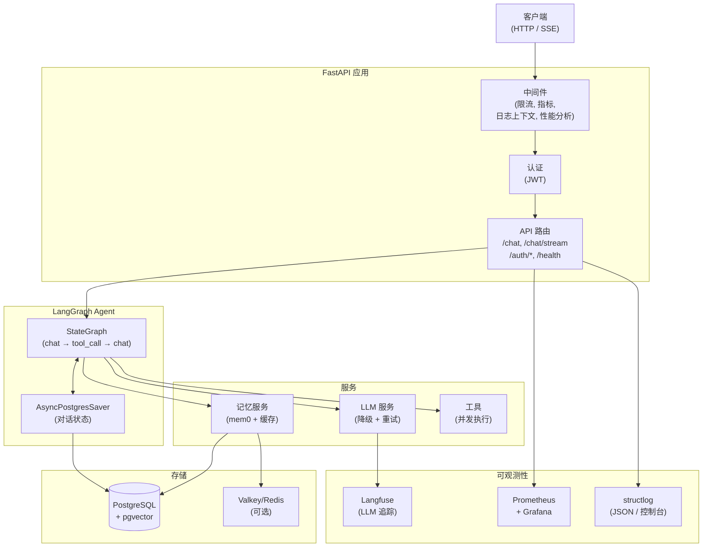
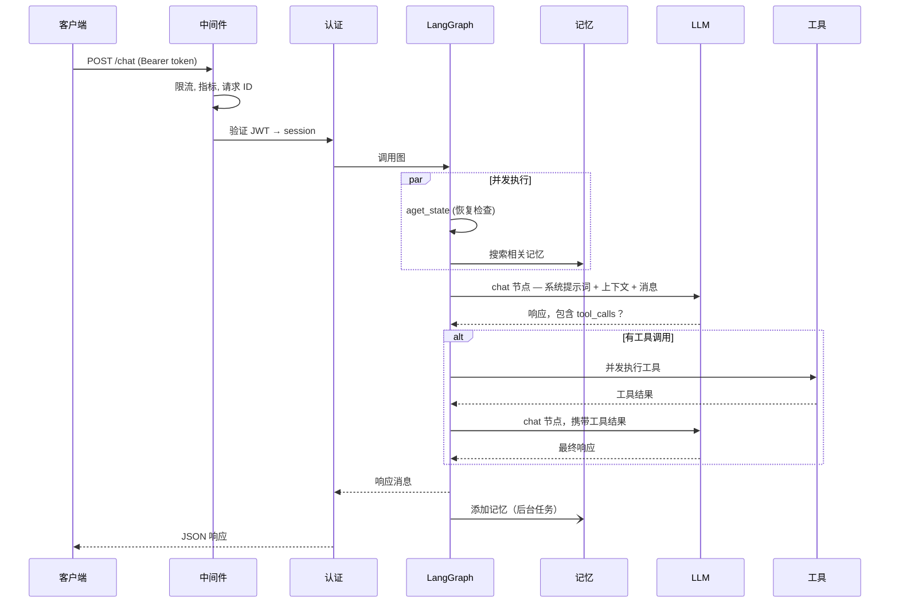
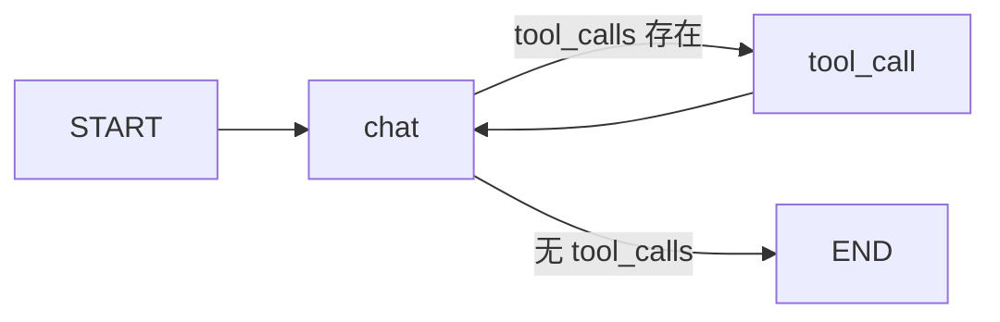

<a href="./architecture.en-US.md">English</a>

# 架构

## 系统概述

## 请求生命周期

## Agent 图

Agent 是一个双节点 `StateGraph`：

- **`chat` 节点** — 构建系统提示词，调用 LLM，返回 `Command` 路由到 `tool_call` 或 `END`
- **`tool_call` 节点** — 并发执行所有工具调用，将结果反馈给 `chat`
- **检查点** — `AsyncPostgresSaver` 为每个 `thread_id`（会话）持久化完整的 `GraphState`，支持中断恢复和多轮对话记忆

## 关键设计决策

**记忆搜索和状态检查并发运行。** 在每个非恢复请求上，`aget_state`（检查中断）和 `memory.search`（获取相关记忆）通过 `asyncio.gather` 并行运行，每个请求节省 200-500ms。

**工具调用并发执行。** 当 LLM 在一次响应中返回多个工具调用时，它们都通过 `asyncio.gather` 并行执行。

**系统提示词在模块加载时缓存。** `system.md` 在启动时读取一次。每请求成本仅为 `.format()`，包含用户名、当前日期时间和检索到的记忆 — 无文件 I/O。

**LLM 降级有时间限制。** 整个降级循环（重试次数 × 模型数）包装在 `asyncio.wait_for(timeout=LLM_TOTAL_TIMEOUT)` 中，防止无限挂起。

**用户名通过 session 传递，而非每次请求时查询数据库。** 用户的显示名称在会话创建时复制到 `Session.username`。聊天请求从已加载的 session 对象中读取 — 零额外查询。

**会话标题生成零延迟。** 在未命名会话的第一条消息上，API 原子性地用占位名称（用户消息的截断版本）声明会话，然后触发后台 `asyncio.Task` 调用快速 nano 模型生成结构化输出。主要聊天响应立即返回 — 标题生成并发运行。Postgres 中的原子 `UPDATE … WHERE name = ''` 确保即使在并发请求下也只有一个工作线程赢得声明。

## 组件职责

| 组件 | 文件 | 职责 |
|---|---|---|
| LangGraph Agent | `app/core/langgraph/graph.py` | 编排对话循环 |
| LLM 服务 | `app/services/llm/` | 模型注册表、重试、循环降级、结构化输出 |
| 记忆服务 | `app/services/memory.py` | mem0 语义记忆 + 缓存 |
| 会话命名 | `app/services/session_naming.py` | 后台 LLM 为新会话生成标题 |
| 数据库服务 | `app/services/database.py` | 用户/会话 CRUD |
| 缓存服务 | `app/core/cache.py` | Valkey/Redis，带内存降级 |
| 中间件 | `app/core/middleware.py` | 指标、日志上下文、性能分析 |
| 认证 | `app/api/v1/auth.py` | JWT 创建、会话管理 |
