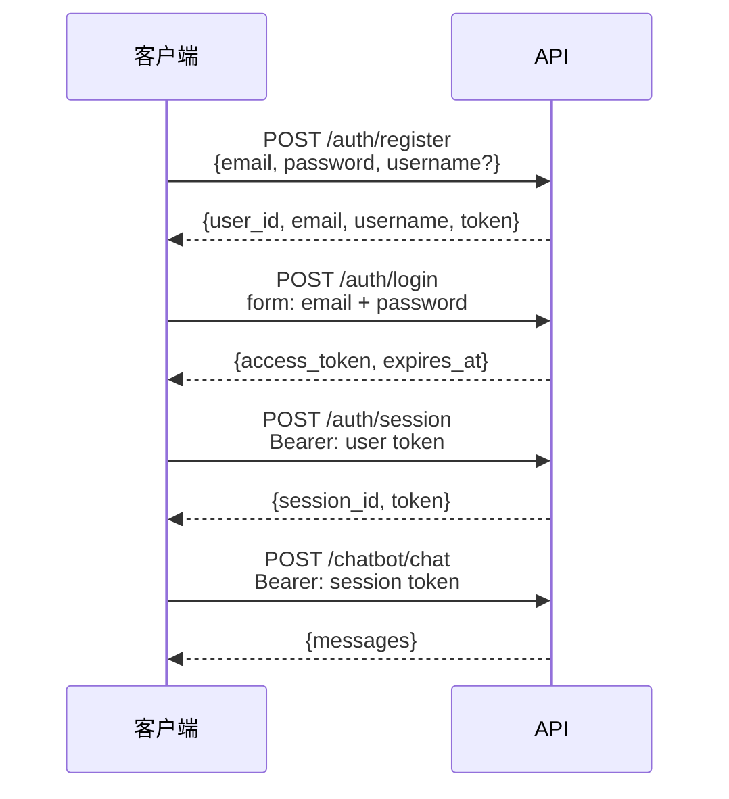

<div align="right"><a href="./authentication.en-US.md">English</a></div>

# 认证

## 流程



API 使用**两种令牌作用域**：

- **用户令牌** — 在注册/登录时颁发，标识用户。用于创建和列出会话。
- **会话令牌** — 每个对话会话颁发。所有聊天端点都需要。作用域限定为单个 `session_id`。

两者都是带 `jti` 声明的签名 JWT（HS256），可配置过期时间（`JWT_ACCESS_TOKEN_EXPIRE_DAYS`）。

---

## 端点

### `POST /api/v1/auth/register`

创建新账户。

```json
{
  "email": "you@example.com",
  "password": "Secret123!",
  "username": "you"
}
```

密码要求：8+ 字符、大写字母、小写字母、数字、特殊字符。

`username` 是可选的。提供时，会传递给 agent 的系统提示词，以便 LLM 知道用户的名字。

---

### `POST /api/v1/auth/login`

凭据换取用户令牌。使用 OAuth2 密码授权表单字段。

```bash
curl -X POST /api/v1/auth/login \
  -F "email=you@example.com" \
  -F "password=Secret123!" \
  -F "grant_type=password"
```

返回 `access_token` 和 `expires_at`。

---

### `POST /api/v1/auth/session`

创建新的聊天会话。需要有效的用户令牌。

```bash
curl -X POST /api/v1/auth/session \
  -H "Authorization: Bearer <user token>"
```

返回 `session_id` 和作用域为会话的 `token`。使用此会话令牌进行所有后续聊天请求。

---

### `PATCH /api/v1/auth/session/{session_id}/name`

重命名会话。

```bash
curl -X PATCH /api/v1/auth/session/{session_id}/name \
  -H "Authorization: Bearer <session token>" \
  -F "name=My research session"
```

---

### `DELETE /api/v1/auth/session/{session_id}`

删除会话及其聊天历史。

---

### `GET /api/v1/auth/sessions`

列出经过身份验证的用户的的所有会话。需要用户令牌。

---

## 安全注意事项

- 密码使用 bcrypt 哈希后存储 — 不会保存明文。
- JWT 包含 `jti`（JWT ID）声明以确保令牌唯一性。
- 所有字符串输入在使用前都会进行清理。
- 限流保护注册（10/小时）和登录（20/分钟）端点，防止暴力攻击。
- 生产环境中设置长的随机 `JWT_SECRET_KEY` — 至少 32 个字符。
