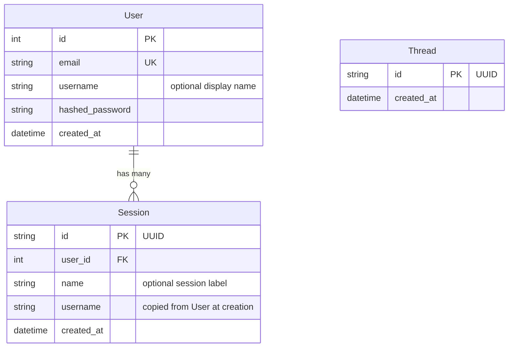

<div align="right">[\[English\]](./database.en-US.md)</div>

# 数据库与迁移

## 架构



**User** — 每个账户一个。Email 唯一。`username` 是可选的，用于个性化系统提示词。

**Session** — 每个对话一个。用户可以有多个会话。`username` 在创建时从 `User` 反规范化，这样聊天请求永远不需要额外的数据库查询。会话 JWT 将所有聊天请求限定作用域。

**Thread** — 镜像 LangGraph 的 `AsyncPostgresSaver` 检查点线程。跟踪应用上下文中存在的线程。

LangGraph 检查点程序还创建自己的表（`checkpoints`、`checkpoint_blobs`、`checkpoint_writes`）— 这些由 LangGraph 自己管理，不通过 Alembic。

pgvector 创建 `longterm_memory` 集合表，由 mem0 管理 — 也不通过 Alembic。

---

## 使用 Alembic 进行迁移

所有架构更改都通过 Alembic 管理。应用不再在启动时调用 `create_all()` — Alembic 拥有架构。

### 初始设置（全新数据库）

```bash
make migrate              # 将所有迁移应用到数据库
```

### 模型更改后创建迁移

```bash
# 1. 编辑您的 SQLModel 模型（app/models/）
# 2. 生成迁移
make migration MSG="add phone number to user"

# 3. 审查 alembic/versions/ 中生成的文件
# 4. 应用它
make migrate
```

### 其他命令

```bash
make migrate-downgrade    # 回滚上一个迁移
make migrate-history      # 显示完整的迁移历史
```

Alembic 从您的 `.env` 文件（通过 `app/core/config.py`）读取数据库凭据。运行迁移前确保设置了正确的 `APP_ENV`。

### autogenerate 工作原理

`env.py` 导入所有 SQLModel 模型以注册其元数据，然后调用 `alembic revision --autogenerate`。Alembic 将当前数据库架构与模型进行对比，生成 upgrade/downgrade 函数。

外部表（LangGraph 检查点、mem0、pgvector）通过 `alembic/env.py` 中的 `include_object` 排除，因此 Alembic 永远不会触碰它们。

### 添加新模型

1. 创建 `app/models/your_model.py`
2. 在 `alembic/env.py` 中与其他模型导入一起导入它
3. 运行 `make migration MSG="add your_model table"`

---

## 在全新数据库中添加 pgvector

pgvector 必须在运行迁移之前启用：

```sql
CREATE EXTENSION IF NOT EXISTS vector;
```

使用 Docker（`make docker-up`）时，`db` 服务自动处理此操作。对于外部数据库（例如 Supabase），通过仪表板或 SQL 编辑器启用扩展。
