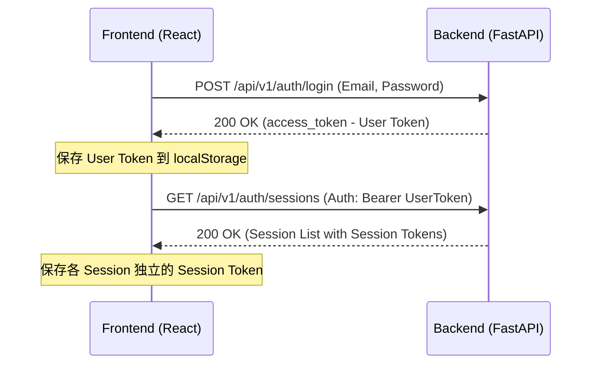
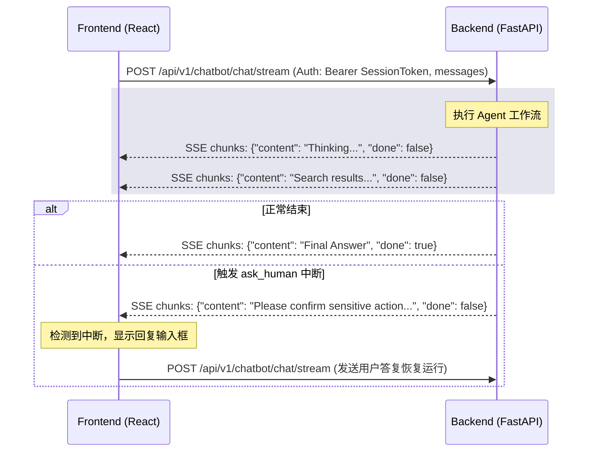

# 001 前端页面开发 — 实现设计

## 实现 Checklist

- [ ] **项目环境初始化**
  - [ ] 生成 React + TypeScript + Vite 的项目目录 `/frontend`
  - [ ] 配置 `vite.config.ts` 中的 API 代理（解决开发环境跨域问题）
  - [ ] 安装 Tailwind CSS、PostCSS 及 Autoprefixer 并配置 tailwind.config.js
  - [ ] 初始化 shadcn/ui 基底并安装基础 UI 组件（Button, Input, Dialog, Dropdown 等）
  - [ ] 安装前端基础依赖（图标库 `lucide-react`，Markdown 解析库 `react-markdown` 等）
- [ ] **全局样式与主题设计**
  - [ ] 编写 `/frontend/src/styles/index.css`，配置 Tailwind 变量、定义 Glassmorphism 样式与深色主题微调
  - [ ] 实现交互微动画（组件 Hover 变色、弹窗过渡、打字机流式输出动画）
- [ ] **API 封装与状态管理**
  - [ ] 封装认证与会话 API 请求（注册、登录、获取会话、创建/删除/重命名会话）
  - [ ] 封装流式对话接口，实现对 SSE（Server-Sent Events）流式响应的解析
  - [ ] 实现全局认证状态与当前会话上下文（JWT 本地化存储）
- [ ] **核心 UI 组件开发**
  - [ ] `AuthScreen`：优雅的注册/登录切换页面，支持表单验证和错误提示
  - [ ] `Sidebar`：左侧会话管理器，展示会话列表，提供新建/重命名/删除会话的操作入口，展示当前登录用户名及登出按钮
  - [ ] `ChatWindow`：右侧聊天主区域，呈现消息气泡，支持流式输出和 Markdown 语法解析
  - [ ] `ThinkingIndicator`：Agent 工具执行/思考中状态指示器
  - [ ] `HumanPromptCard`：当 Agent 中断挂起（`ask_human`）时，呈现交互式卡片以供用户确认或回复
- [ ] **后端配置微调**
  - [ ] 更新后端 `.env.development` 中的 `ALLOWED_ORIGINS`，添加前端开发服务地址 `http://localhost:5173`

## 数据与迁移

本项目为纯前端 React 单页应用，**不涉及**后端数据库表的结构变动，因此无需进行 Alembic 迁移。
前端利用浏览器的 `localStorage` 进行用户 JWT（User Token）和当前会话 Token（Session Token）的持久化存储。

## API 与状态流转

### 1. 认证与会话获取

### 2. 对话流式传输与人机交互 (ask_human)

## 文件改动

### 新增文件

- `/frontend/package.json`：前端依赖管理
- `/frontend/vite.config.ts`：Vite 配置文件与 Proxy 代理
- `/frontend/index.html`：单页应用根 HTML 页面
- `/frontend/src/main.tsx`：React 应用入口文件
- `/frontend/src/App.tsx`：根组件与状态/视图路由分发
- `/frontend/src/styles/index.css`：原生 CSS 样式系统
- `/frontend/src/services/api.ts`：封装与 FastAPI 通信的所有 HTTP/SSE 逻辑
- `/frontend/src/components/AuthScreen.tsx`：登录注册界面组件
- `/frontend/src/components/Sidebar.tsx`：侧边栏会话管理器组件
- `/frontend/src/components/ChatWindow.tsx`：对话界面与输入框组件
- `/frontend/src/components/ThinkingIndicator.tsx`：思考状态组件
- `/frontend/src/components/HumanPromptCard.tsx`：人机交互提示卡片组件

### 修改文件

- [MODIFY] [.env.development](file:///d:/CodeWorkSpace/AgentWorkspace/landslide-monitoring-agent/.env.development)：
  修改 `ALLOWED_ORIGINS` 允许 `http://localhost:5173`。

## 异步与事务设计

- **流式响应处理**：使用 `fetch` 结合 `ReadableStream` 异步逐块读取响应，通过 `TextDecoder` 解码 SSE 数据格式 `data: {...}`，实时渲染 Agent 回复。
- **人机交互恢复机制**：当前端通过流式响应的最后一条消息或会话状态，判断 Agent 处于 `ask_human` 挂起时，禁止普通发送框，并渲染 `HumanPromptCard`。用户点击确认或输入补充说明并提交后，该输入作为新消息追加至会话历史中并提交至 `/chatbot/chat/stream`，后端将自动触发 `Command(resume=...)` 逻辑恢复 Graph 运行。

## 错误处理、观测与安全

- **错误捕获**：封装通用的请求异常捕获，处理 Token 过期（HTTP 401）、请求限频（HTTP 429）等错误，并给出友好的视觉 Toast 提示。
- **Token 安全**：User Token 和 Session Token 分开存放。调用会话接口时使用 User Token，调用对话流接口时必须使用对应会话的 Session Token。
- **输入过滤**：对用户输入进行基本的 HTML 转义与长度限制，防止 XSS 攻击。

## 实现计划

1. **第 1 步**：初始化 `/frontend` 目录与依赖，微调后端 `.env.development` 允许跨域。
2. **第 2 步**：编写 `index.css` 视觉系统，实现深色毛玻璃主题。
3. **第 3 步**：在 `services/api.ts` 中封装所有的 REST API 与 SSE 交互逻辑。
4. **第 4 步**：依次实现 `AuthScreen`、`Sidebar`、`ChatWindow`（集成 Markdown）、`ThinkingIndicator` 和 `HumanPromptCard`。
5. **第 5 步**：本地联合调试与验收测试。
