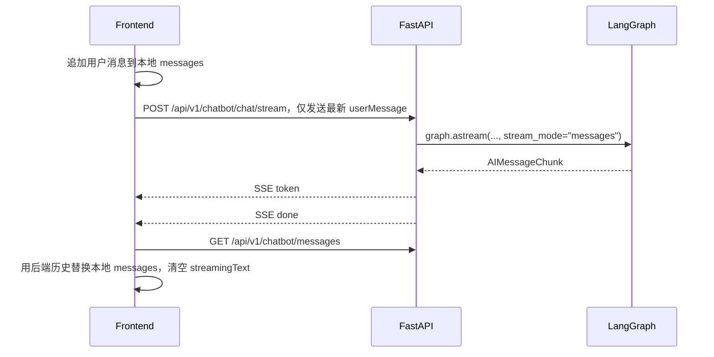
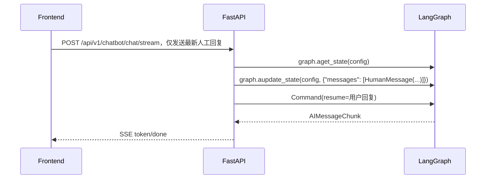

# 002 前端会话与消息渲染轻量修复 — 实现设计

## 实现 Checklist

- [x] **左侧会话操作按钮降噪**
  - [x] 会话项保留 `role="option"`、`aria-selected` 和键盘 Enter/Space 激活。
  - [x] 重命名、删除按钮默认 `opacity-0` 且禁用 pointer events。
  - [x] hover 或 focus-within 时按钮恢复显示和可点击。
  - [x] 纯图标按钮补充 `aria-label`。

- [x] **AI 消息拆分修复**
  - [x] `app/core/langgraph/graph.py` 中 `__process_messages` 过滤空内容。
  - [x] 连续 `assistant` 消息合并为一个 `Message(role="assistant")`，中间以空行分隔。
  - [x] 增加单元测试覆盖连续 assistant 合并。

- [x] **人工干预回复持久化**
  - [x] `get_response` 遇到 `state.next` 时先 `graph.aupdate_state` 写入 `HumanMessage`。
  - [x] `get_stream_response` 遇到 `state.next` 时先 `graph.aupdate_state` 写入 `HumanMessage`。
  - [x] 前端人工干预恢复时只提交最新一条用户回复。

- [x] **SSE 外层协议与前端流式健壮性**
  - [x] `StreamResponse` 增加 `event`、`tool_name`、`tool_input`、`error` 字段。
  - [x] FastAPI SSE 包装层输出 `token`、`done`、`error` 事件。
  - [x] `frontend/src/services/api.ts` 的 `streamChat` 支持 `signal?: AbortSignal`。
  - [x] `streamChat` 识别服务端错误事件和 `error` 字段。
  - [x] `streamChat` 在流提前结束且未收到 `done: true` 时触发错误。
  - [x] `streamChat` 在 `finally` 中释放 reader lock。

- [x] **会话并发隔离**
  - [x] `App.tsx` 使用 `activeSessionRef` 跟踪当前会话。
  - [x] `App.tsx` 使用 `fetchAbortControllerRef` 取消旧历史请求。
  - [x] `App.tsx` 使用 `streamAbortControllerRef` 取消旧流式请求。
  - [x] 切换会话、新建草稿、退出登录时清理旧状态。
  - [x] 流式回调、同步历史回调均校验当前会话 ID。

- [x] **生成状态展示**
  - [x] `ChatWindow` 在流式气泡中显示旋转图标和“正在生成回复...”。
  - [x] `ThinkingIndicator` 支持外部传入状态文本。
  - [x] `App.tsx` 预留 `toolStatus` 状态，若收到工具事件可显示工具状态摘要。

- [x] **Markdown 渲染修复**
  - [x] 新增 `MarkdownMessage` 组件。
  - [x] 新增 `remark-gfm` 依赖，支持 GFM 表格。
  - [x] `ChatWindow` 普通消息和流式消息统一使用 `MarkdownMessage`。
  - [x] `index.css` 增加 `.message-markdown`、`.markdown-table-wrap` 等样式。
  - [x] 增加前端测试验证 GFM 表格渲染为真实 table。

- [x] **输入长度限制**
  - [x] `ChatWindow` 普通输入框限制 3000 字符。
  - [x] `HumanPromptCard` 人工干预输入框限制 3000 字符。
  - [x] 两处输入框均显示当前字符数和 3000 上限。
  - [x] 接近上限时计数器变为红色。

- [x] **版本库缓存清理**
  - [x] `.gitignore` 忽略 `frontend/node_modules/`、`frontend/.npm-cache/`、`frontend/dist/`、Vite 缓存。
  - [x] 前端依赖缓存不再出现在当前 `git status` 输出中。

- [ ] **后续：真实工具事件流**
  - [ ] 将 `get_stream_response` 从 `graph.astream(..., stream_mode="messages")` 改为 `astream_events(version="v2")`。
  - [ ] 映射 `on_tool_start`、`on_tool_end` 为 `tool_start/tool_end` SSE 事件。

- [ ] **后续：移动端 Drawer**
  - [ ] 增加 `sidebarOpen` 状态、Backdrop、菜单按钮和关闭按钮。
  - [ ] 将根布局高度从 `h-screen` 调整为移动端更友好的 `100dvh` 策略。

- [ ] **后续：前端 CI**
  - [ ] 更新 `.github/workflows/test.yml`，增加 Node 环境。
  - [ ] 在 CI 中执行 `npm ci`、`npm test`、`npm run build`。

## 数据与迁移

本轮不修改数据库 Schema，不需要 Alembic 迁移。

后端只通过 LangGraph Checkpointer 写入已有消息状态：

- 普通对话仍由 graph checkpoint 保存。
- 中断恢复时新增显式 `HumanMessage` 写入，确保人工干预回复作为用户消息留存在历史中。

## API 与状态流转

### SSE 响应结构

当前 `StreamResponse` 支持如下字段：

```json
{
  "event": "token | done | error | tool_start | tool_end",
  "content": "abc",
  "done": false,
  "tool_name": null,
  "tool_input": null,
  "error": null
}
```

当前后端实际产出的事件为：

- `token`：普通流式文本片段。
- `done`：流式结束。
- `error`：流式处理异常。

`tool_start` 和 `tool_end` 只是 schema 与前端预留能力；真实事件生产留到后续 `astream_events` 任务。

### 普通消息发送



### 中断恢复



## 文件改动

### 修改文件

- `AGENTS.md`：优化语言规则，新增任务清单同步规则。
- `.gitignore`：忽略前端依赖、npm 缓存、构建产物和 Vite 缓存。
- `app/api/v1/chatbot.py`：SSE 包装层输出结构化 `StreamResponse`。
- `app/core/langgraph/graph.py`：人工干预回复写入 state，历史消息合并连续 assistant。
- `app/schemas/chat.py`：扩展 `StreamResponse` 字段。
- `app/services/session_naming.py`：默认会话名与中文界面保持一致。
- `frontend/package.json`、`frontend/package-lock.json`：新增 `remark-gfm`。
- `frontend/src/App.tsx`：增加 AbortController、当前会话隔离、工具状态、仅提交最新消息等。
- `frontend/src/components/ChatWindow.tsx`：生成中标志、Markdown 渲染、输入长度限制和计数器。
- `frontend/src/components/HumanPromptCard.tsx`：人工干预输入长度限制和计数器。
- `frontend/src/components/Sidebar.tsx`：hover/focus 操作按钮、键盘可访问与 aria 标签。
- `frontend/src/services/api.ts`：流式解析、错误处理、Abort 信号。
- `frontend/src/styles/index.css`：Markdown 和表格样式。
- `tests/unit/test_agent_workflows.py`：后端消息合并测试。
- `tests/unit/test_graph_llm_and_session_naming.py`：会话默认名断言同步。

### 新增文件

- `frontend/src/components/MarkdownMessage.tsx`：统一 Markdown 渲染组件。
- `frontend/src/components/__tests__/MarkdownMessage.test.tsx`：GFM 表格渲染测试。
- `frontend/src/services/__tests__/api.test.ts`：SSE 正常、错误、断流和 Abort 测试。

## 异步与事务设计

- 历史加载和流式请求各自使用独立 `AbortController`，避免不同请求互相误取消。
- 每个异步回调在写入 UI 状态前校验 `activeSessionRef.current?.session_id`。
- 流式完成后再拉取后端历史，使用服务端 checkpoint 作为最终消息状态来源。
- 本轮不引入数据库事务变更。

## 错误处理、观测与安全

- SSE 解析遇到服务端 `error` 事件时触发前端错误回调，结束 loading。
- SSE 自然结束但没有 `done: true` 时视为协议异常，避免无限 loading。
- React Markdown 默认不启用原始 HTML 渲染，本轮未引入 `rehypeRaw`，降低 XSS 风险。
- 输入框使用物理 `maxLength` 限制 3000 字符，降低超长输入导致的交互和请求风险。

## 验证记录

- `npm test`：通过。
- `npm run build`：通过。
- `make check`：通过。
- 浏览器烟测：通过，验证主聊天界面、Markdown 表格、输入框、发送按钮和左侧会话按钮 hover/focus 状态。
- 后端专项 `pytest tests/unit/test_agent_workflows.py tests/unit/test_graph_llm_and_session_naming.py -q`：当前环境缺少 `pytest_asyncio`，未能运行，不是断言失败。

## 后续计划

1. 确认删除最后一个活动会话且无剩余会话时，是创建新会话还是进入空白欢迎状态。
2. 需要真实工具进度时，单独实现 `astream_events(version="v2")`。
3. 需要移动端体验时，单独实现 Drawer。
4. 需要 CI 覆盖前端时，单独更新 GitHub Actions。
