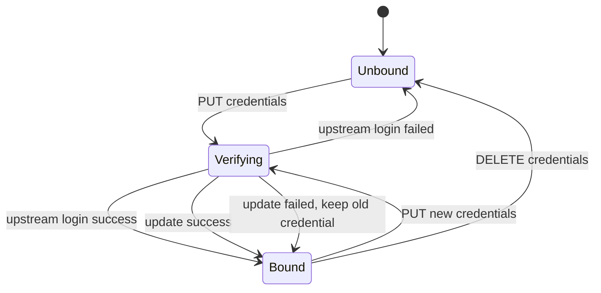

# 004 北斗凭据绑定与校验 — 实现设计

## 实现 Checklist

- [x] 用户可以查询自己的北斗凭据绑定状态；未绑定返回 `bound=false`。
- [x] 已绑定状态返回 `bound=true` 和北斗用户名，不返回明文密码、加密密码或 `SessionUUID`。
- [x] 用户可以提交北斗用户名和密码进行绑定。
- [x] 用户可以提交新北斗用户名和密码更新已有绑定。
- [x] 保存或更新前必须调用北斗登录认证接口验证上游可用性。
- [x] 上游验证失败时不得保存新凭据，也不得覆盖已有有效凭据。
- [x] 上游验证成功后加密保存北斗密码。
- [x] 上游验证成功后缓存 `SessionUUID` 和估算会话过期时间。
- [x] 用户可以解绑自己的北斗凭据。
- [x] 解绑后状态接口返回未绑定，后续北斗/GNSS 能力可通过绑定状态识别授权缺失。
- [x] 缺少加密密钥配置时拒绝保存凭据。
- [x] 所有相关路由使用认证依赖和限流装饰器。
- [x] 所有新增数据库操作使用异步数据库访问。
- [x] 日志使用 structlog，事件名为 lowercase_with_underscores。
- [x] 日志不记录明文密码、加密前密码或 `SessionUUID` 明文。
- [x] `.env.example` 和 `Settings` 增加北斗 API 基址、凭据加密密钥、请求超时等配置。

## 数据与迁移

### 新增数据表

新增 `beidou_credential` 表，保存用户级北斗平台凭据。

建议字段：

| 字段 | 类型 | 约束 | 说明 |
| --- | --- | --- | --- |
| `id` | int | primary key | 凭据记录 ID |
| `user_id` | int | foreign key `user.id`, unique, index | 本地用户 ID；每个用户最多一条北斗凭据 |
| `beidou_username` | str | not null, index | 北斗平台用户名，状态接口原样返回 |
| `encrypted_password` | str | not null | 加密后的北斗平台密码 |
| `session_uuid_encrypted` | str \| null | nullable | 加密后的北斗 `SessionUUID`，不明文入库 |
| `session_expires_at` | datetime \| null | nullable | 估算会话过期时间 |
| `last_verified_at` | datetime | not null | 最近一次上游登录验证成功时间 |
| `updated_at` | datetime | not null | 最近更新时间 |
| `created_at` | datetime | not null | 创建时间，沿用 `BaseModel` |

设计取舍：

- `beidou_username` 按用户确认不脱敏返回，但仍不应写入不必要的错误上下文。
- `SessionUUID` 虽可缓存，但属于可复用上游会话凭证，入库时同样加密；状态接口和日志均不返回。
- `encrypted_password` 和 `session_uuid_encrypted` 使用同一加密服务处理，便于后续北斗数据查询复用。
- `user_id` 使用唯一约束，绑定和更新都是 upsert 语义。

### Alembic 迁移

新增迁移文件，创建 `beidou_credential` 表、`user_id` 唯一索引和必要普通索引。

`alembic/env.py` 当前显式导入已有模型以支持 autogenerate；实现时需要新增导入 `app.models.beidou_credential.BeidouCredential`，否则 autogenerate 可能识别不到新表。

### 配置项

在 `Settings` 和 `.env.example` 中新增：

| 配置 | 默认值 | 说明 |
| --- | --- | --- |
| `BEIDOU_API_BASE_URL` | `http://39.96.80.62/bdjc-api/v2/API` | 北斗平台 API 基址 |
| `BEIDOU_CREDENTIAL_ENCRYPTION_KEY` | 空 | Fernet 对称加密密钥；为空时拒绝保存凭据 |
| `BEIDOU_API_TIMEOUT_SECONDS` | `10` | 北斗上游 HTTP 超时 |
| `BEIDOU_SESSION_TTL_SECONDS` | `28800` | 北斗会话估算有效期，8 小时 |
| `RATE_LIMIT_BEIDOU_CREDENTIALS` | 继承默认或单独配置 | 凭据绑定相关路由限流 |

加密密钥建议使用 `cryptography.fernet.Fernet` 所需的 urlsafe base64 32 字节密钥。实现时不自动生成生产密钥，避免重启后无法解密历史凭据。

## API 与状态流转

### 路由

新增 `app/api/v1/beidou.py`，并在 `app/api/v1/api.py` 中挂载：

```text
GET    /api/v1/beidou/credentials/status
PUT    /api/v1/beidou/credentials
DELETE /api/v1/beidou/credentials
```

### 认证依赖

凭据是用户级资源。当前项目存在两类 token：

- 登录后返回的用户 token，可通过 `get_current_user` 解析。
- 创建会话后返回的 session token，可通过 `get_current_session` 解析到 `user_id`。

为避免前端处于会话态时无法维护凭据，建议新增一个只用于用户级资源的依赖，例如 `get_current_user_from_any_token`：

1. 先按用户 token 尝试解析并读取 `User`。
2. 若解析为非整数或用户不存在，再按 session token 读取 `Session`，使用 `session.user_id` 查询 `User`。
3. 两种方式都失败时返回 401/404。

该依赖只解析身份，不改变 token 颁发方式。

### 请求/响应模型

新增 `app/schemas/beidou.py`。

`BeidouCredentialStatusResponse`：

```json
{
  "bound": true,
  "username": "beidou_user",
  "last_verified_at": "2026-06-29T10:00:00Z",
  "session_expires_at": "2026-06-29T18:00:00Z"
}
```

未绑定：

```json
{
  "bound": false,
  "username": null,
  "last_verified_at": null,
  "session_expires_at": null
}
```

`BeidouCredentialUpsertRequest`：

```json
{
  "username": "beidou_user",
  "password": "plain password only in request body"
}
```

Pydantic 约束：

- `username`: 非空，最大长度按北斗文档约束 32 或保守设为 64。
- `password`: 使用 `SecretStr`，长度按北斗文档 12-64。

`BeidouCredentialUpsertResponse`：

```json
{
  "bound": true,
  "username": "beidou_user",
  "last_verified_at": "2026-06-29T10:00:00Z",
  "session_expires_at": "2026-06-29T18:00:00Z"
}
```

`DELETE` 成功返回：

```json
{
  "bound": false
}
```

### 状态流转



要点：

- 新绑定验证失败保持 `Unbound`。
- 更新验证失败保持旧 `Bound`，不得覆盖旧凭据。
- 解绑是幂等操作；未绑定时 DELETE 可返回成功的 `bound=false`。

## 文件改动

预计新增：

- `app/models/beidou_credential.py`：SQLModel 凭据模型。
- `app/schemas/beidou.py`：请求/响应 schema。
- `app/services/beidou/client.py`：北斗上游 HTTP client，只实现 `login`。
- `app/services/beidou/credentials.py`：凭据绑定、更新、解绑、状态查询、上游验证流程。
- `app/services/beidou/crypto.py`：Fernet 加密/解密服务。
- `app/services/async_database.py` 或局部异步 session 工厂：为本功能提供异步数据库访问。
- `app/api/v1/beidou.py`：凭据路由。
- `alembic/versions/{revision}_add_beidou_credential.py`：数据库迁移。

预计修改：

- `app/core/config.py`：新增北斗配置项和凭据路由限流配置。
- `.env.example`：新增北斗相关配置说明。
- `app/api/v1/api.py`：挂载 `beidou` router。
- `alembic/env.py`：导入新模型以支持迁移 metadata。
- `app/models/user.py`：可选增加与 `BeidouCredential` 的 relationship；若会引入循环复杂度，可先不加 relationship，通过查询语句按 `user_id` 访问。

## 异步与事务设计

### 异步 HTTP

北斗上游登录使用 `httpx.AsyncClient`：

- `POST {BEIDOU_API_BASE_URL}/UserLogin/doLogin.php`
- 请求 JSON：`Username`、`Password`
- 关闭自动重定向或保持显式可控。
- 设置 `BEIDOU_API_TIMEOUT_SECONDS`。
- 对网络错误、超时和 5xx 使用 tenacity 指数退避重试。
- 对认证失败、权限不足、参数格式错误等 4xx/业务失败不重试。

### 异步数据库

新增北斗凭据数据库访问应使用 SQLAlchemy async engine / async session，不沿用现有同步 `DatabaseService` 模式。实现时可建立小范围异步 session 工厂，或先添加通用 `AsyncDatabaseService`，但只在本功能使用。

### 事务边界

绑定/更新流程：

1. 在事务外调用北斗登录验证，避免事务持有期间等待外部 HTTP。
2. 验证成功后开启数据库事务。
3. 加密密码和 `SessionUUID`。
4. upsert 用户凭据。
5. 提交事务。

更新失败处理：

- 若上游验证失败，直接返回错误，不进入写事务。
- 若数据库写入失败，返回服务端错误；旧凭据不应被部分覆盖。

解绑流程：

- 开启事务。
- 按 `user_id` 删除凭据。
- 提交事务。
- 未找到记录也返回 `bound=false`。

## 错误处理、观测与安全

### 错误映射

| 场景 | HTTP 状态码 | 说明 |
| --- | --- | --- |
| 未认证或 token 无效 | 401 | 沿用现有认证语义 |
| 用户不存在 | 404 | 本地用户不存在 |
| 请求字段无效 | 422 | Pydantic 校验失败 |
| 加密密钥未配置 | 500 | 服务端配置错误，拒绝保存 |
| 北斗账号密码错误 | 401 或 400 | 返回可理解认证失败说明 |
| 北斗账号锁定/停用/密码过期 | 400 | 返回上游状态说明，不保存 |
| 北斗上游超时/不可用 | 503 | 可重试错误 |
| 北斗响应格式异常 | 502 | 上游响应不符合契约 |
| 数据库写入失败 | 500 | 记录异常日志 |

### 日志

使用 structlog，建议事件：

- `beidou_credential_status_requested`
- `beidou_credential_bind_requested`
- `beidou_login_verification_started`
- `beidou_login_verification_finished`
- `beidou_credential_saved`
- `beidou_credential_unbound`
- `beidou_credential_operation_failed`

禁止记录：

- 明文密码。
- `SecretStr.get_secret_value()` 的结果。
- 加密前密码。
- `SessionUUID` 明文。

允许记录：

- `user_id`
- `beidou_username`
- 上游 `ResponseCode`
- 失败类别
- 请求耗时

### 安全边界

- 北斗 API endpoint 必须由配置基址和固定路径拼接，不能接受用户传入任意 URL。
- 密码只在请求生命周期内以 `SecretStr` 形式存在，进入加密服务后立即加密。
- 响应体不返回任何凭据材料。
- `SessionUUID` 仅供后续服务端查询复用，不暴露给 LLM、前端或日志。
- 上游响应作为不可信外部数据，只读取白名单字段：`ResponseCode`、`ResponseMsg`、`SessionUUID`。

## 实现计划

1. 新增北斗配置项和 `.env.example` 示例。
2. 新增 `BeidouCredential` 模型并创建 Alembic 迁移。
3. 新增异步数据库访问能力，限定本功能使用。
4. 新增 `BeidouCredential` 请求/响应 schema。
5. 实现 Fernet 加密服务，覆盖密钥缺失和密钥格式错误。
6. 实现北斗登录 client，包含固定 endpoint、超时、重试和响应码映射。
7. 实现凭据服务：状态查询、绑定/更新、解绑。
8. 新增 `beidou` API router，并挂载到 v1 API。
9. 补充认证依赖，支持用户 token 或 session token 解析当前用户。
10. 按测试计划补充单元测试、服务测试和 API 测试。
11. 运行迁移、测试、`make check`，并根据验证结果更新 checklist。
