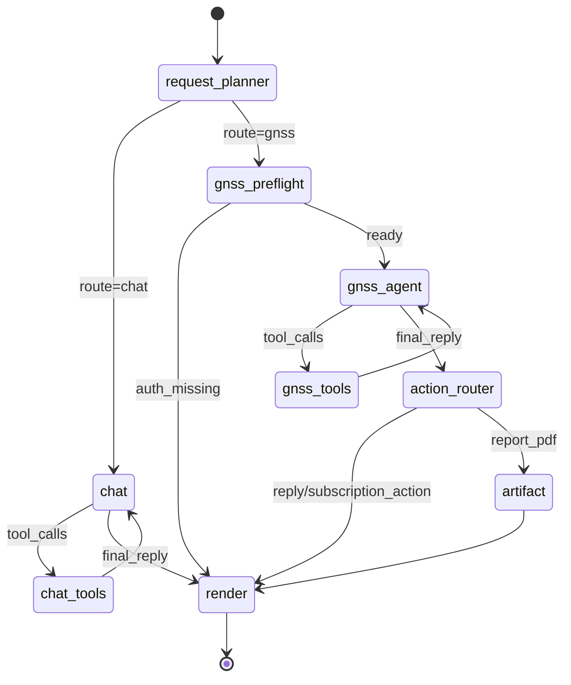

# 005 北斗站点查询与实体解析 — 实现设计

## 实现 Checklist

- [x] `request_planner` 使用 LLM 结构化输出 `AgentPlan`，将请求路由为 `chat` 或 `gnss`。
- [x] `request_planner` 从最近 6 条用户/助手短文本中构造 planner 上下文，并排除 `ToolMessage`、工具调用结果和工具 JSON。
- [x] `request_planner` 根据最新消息和最近对话判断用户真实意图，支持“重新查询”等依赖历史上下文的表达。
- [x] 普通天气、闲聊和非 GNSS 内容进入 `chat` / `chat_tools`，不触发北斗凭据校验。
- [x] GNSS 请求进入 `gnss_agent` 前先经过 `gnss_preflight` 凭证门禁。
- [x] `gnss_preflight` 对用户上下文缺失、北斗凭据缺失或刷新失败直接进入 `render`，不进入 GNSS agent。
- [x] `gnss_agent` 负责 GNSS/北斗站点、监测分析、报告和订阅相关业务对话，并由 LLM 决定是否调用工具。
- [x] `gnss_agent` 只允许请求注册的 GNSS 只读工具，不直接接收或暴露北斗 `SessionUUID`。
- [x] `gnss_tools` 执行 `get_beidou_station_groups`、`get_beidou_station_candidates`、`get_beidou_station_detail` 和无鉴权天气工具 `query_open_meteo_weather`。
- [x] 旧 `get_beidou_station_weather(station_uuid)` 混合工具已从注册集合移除，未知调用返回结构化错误。
- [x] 特定站点天气通过 `get_beidou_station_detail(station_uuid)` 获取经纬度后组合调用 `query_open_meteo_weather(latitude, longitude, ...)`。
- [x] `gnss_tools` 使用当前 `user_id` 解析用户级北斗会话；会话缺失时返回 `auth_missing`，不调用北斗上游。
- [x] `action_router` 识别 `reply`、`report_pdf` 和 `subscription_action`；报告和订阅副作用未接入时返回受控说明。
- [x] `artifact` 保留为报告类动作的中间节点，当前不生成 PDF 副作用。
- [x] `render` 统一生成最终 assistant 消息，覆盖普通回复、授权缺失、执行结果和兜底错误。
- [x] 北斗站点 service 封装固定上游路径、异步 HTTP、`tenacity` 重试、结构化错误映射和规范化 schema。
- [x] 站点列表默认请求 `PageInfo.PageSize=-1`，不再按固定 20 条截断候选。
- [x] 候选投影只保留必要站点字段，不包含 `SessionUUID` 或上游原始响应全文。
- [x] 单元测试覆盖 planner 路由、最近对话上下文、工具消息排除、`gnss_preflight` 授权缺失、普通天气不需要北斗凭据、站点天气组合调用、旧混合天气工具拒绝、GNSS 工具执行、订阅副作用阻断、站点列表全量请求和候选不截断。

## 数据与迁移

本功能不新增数据库表，不新增 Alembic 迁移。

原因：

- 北斗站点数据来自上游接口，当前实现不做持久化缓存。
- 当前用户北斗会话由工具执行时通过用户上下文解析，不在本功能新增业务表。
- 最近对话上下文来自 `GraphState.messages` 和 LangGraph checkpoint，不单独建表。

当前 `GraphState` 与本功能相关字段：

- `messages`：图内消息列表，planner 从中提取最近用户/助手文本。
- `long_term_memory`：进入图前的记忆上下文，由现有 preflight 逻辑填充。
- `route`：`"chat"` 或 `"gnss"`。
- `plan`：`AgentPlan` 结构化结果，包含 `route`、`intent`、`needs_station`、`needs_weather`、`reason` 等字段。
- `station_candidates`：裁剪后的候选站点列表。
- `resolved_station`：已解析的站点事实，保留给后续能力扩展。
- `execution_result`：结构化执行结果，当前主要作为 `render` 兜底输入。
- `action_type`：`reply`、`report_pdf` 或 `subscription_action`。
- `unsupported_reason`：报告占位等旧分支的受控说明字段。
- `gnss_tool_rounds`：GNSS 工具调用轮次，防止工具循环失控。
- `chat_tool_rounds`：普通工具调用轮次，防止工具循环失控。
- `chat_response`：GNSS agent 生成的最终自然语言回复。
- `gate`：`gnss_preflight` 输出的结构化门禁结果，授权缺失时由 `render` 生成受控提示。

上述状态不得保存北斗密码、加密密码、`SessionUUID` 或其他可复用凭据。

## API 与状态流转

### 对外 API

不新增公开 REST API。

本功能通过现有聊天接口进入：

- `POST /api/v1/chatbot/chat`
- `POST /api/v1/chatbot/chat/stream`
- `GET /api/v1/chatbot/messages`

用户身份和会话身份沿用现有认证链路，并通过 `RunnableConfig.metadata` 传入图节点和工具运行器。

### 内部状态流转

### `request_planner`

`request_planner` 的职责：

- 只判断最后一条用户消息的业务路由和高层意图。
- 结合最近对话处理省略主语、重试、刷新、重新查询和上下文指代。
- 输出 `AgentPlan`，其中 `route` 只能是 `chat` 或 `gnss`。
- 不做站点事实查询，不用固定字符串规则替代语义判断。

当前 planner 上下文构造规则：

- 最多取最近 6 条消息。
- 每条消息最多保留 300 个字符。
- 只包含 `HumanMessage` 和文本型 `AIMessage`。
- 排除 `ToolMessage`、工具调用返回值、非文本块和工具 JSON。

当前 `AgentPlan.intent` 允许值：

- `unsupported`
- `chat`
- `weather`
- `station_groups`
- `station_list`
- `station_lookup`
- `station_detail`
- `gnss_analysis`
- `report_pdf`
- `subscription_action`
- `unknown`

### `chat` 与 `chat_tools`

`chat` / `chat_tools` 的职责：

- 处理普通问答、天气和非 GNSS 内容。
- 只能调用普通只读工具集合，例如 `query_open_meteo_weather` 和通用搜索工具。
- 不读取北斗凭据，不访问北斗上游，不调用站点或 GNSS 监测数据工具。
- 工具调用轮次超过限制时返回受控失败提示。

### `gnss_preflight`

`gnss_preflight` 的职责：

- 在进入 `gnss_agent` 前检查当前 `user_id` 是否存在可用北斗会话，必要时触发用户级凭据刷新。
- 凭证缺失、用户上下文缺失、解密失败或刷新失败时写入 `GateDecision(status="auth_missing")` 并进入 `render`。
- 不查询站点、分组或监测数据。
- 不把北斗 `SessionUUID` 放入 LLM prompt、消息、日志或用户响应。

### `gnss_agent`

`gnss_agent` 的职责：

- 面向 GNSS/北斗监测业务组织对话。
- 需要事实时由 LLM 发起工具调用。
- 没有工具调用时，将回复写入 `chat_response` 并转入 `action_router`。
- 工具调用轮次超过限制时，返回受控失败提示，避免长时间循环。

### `gnss_tools`

`gnss_tools` 的职责：

- 执行受控工具调用。
- 使用 `RunnableConfig.metadata.user_id` 获取当前用户上下文。
- 未知工具返回结构化错误。
- 当前用户无北斗会话时返回 `auth_missing`，不访问北斗上游。

已注册工具：

- `get_beidou_station_groups`
- `get_beidou_station_candidates`
- `get_beidou_station_detail`
- `query_open_meteo_weather`

站点天气约束：

- `get_beidou_station_weather(station_uuid)` 已移除，不再是授权工具。
- 查询北斗站点天气时，GNSS agent 必须先调用 `get_beidou_station_detail(station_uuid)` 获取经纬度，再调用 `query_open_meteo_weather(latitude, longitude, ...)`。
- 普通天气查询应走 `chat_tools`，不进入 `gnss_preflight`。

### `action_router`、`artifact` 与 `render`

`action_router` 根据 `AgentPlan.intent` 和 `chat_response` 决定下一步：

- 普通回复进入 `render`。
- 报告 PDF 意图进入 `artifact`，当前返回“能力未接入”的受控说明。
- 订阅动作当前不执行副作用，进入 `render` 返回受控说明。

`render` 根据当前状态生成最终 assistant 消息：

- `chat_response`：输出 GNSS agent 回复。
- `execution_result` 或 `gate`：用于兼容旧状态或兜底。
- 其他异常状态：输出统一失败提示。

## 文件改动

当前实现涉及文件：

- `app/core/langgraph/graph.py`：当前图拓扑、planner 上下文提取、GNSS agent、工具执行、动作路由和渲染逻辑。
- `app/core/langgraph/tools/__init__.py`：普通工具集合 `chat_tools` 与 GNSS 工具集合 `gnss_tools` 的注册边界。
- `app/core/langgraph/tools/gnss.py`：GNSS/北斗站点工具定义和用户会话隔离。
- `app/core/langgraph/tools/open_meteo_weather.py`：无北斗鉴权的纯经纬度 Open-Meteo 天气工具。
- `app/schemas/beidou_station.py`：北斗站点、分组、候选、`AgentPlan`、兼容性 `GateDecision` 和 `AnalyzeExecutionResult` schema。
- `app/schemas/graph.py`：图状态字段。
- `app/services/beidou/stations.py`：北斗站点 client/service、固定路径访问、字段投影和错误映射。
- `app/core/config.py`：北斗上游配置和 `BEIDOU_STATION_PAGE_SIZE`，当前默认值为 `-1`。
- `tests/unit/test_gnss_graph_nodes.py`：当前图节点和 planner 上下文测试。
- `tests/unit/test_open_meteo_weather_tool.py`：纯经纬度天气工具输入、缓存、错误和安全边界测试。
- `tests/unit/test_beidou_station_service.py`：站点 service、分页、候选投影和错误映射测试。
- `tests/unit/test_agent_workflows.py`：现有 agent 工作流、流式输出和消息过滤测试。
- `tests/unit/test_graph_llm_and_session_naming.py`：LLM 调用、结构化输出和工具结果过滤相关测试。

当前没有新增独立的 GNSS planner、gate 或 response prompt markdown 文件；planner 和 GNSS agent 的提示词目前在 `app/core/langgraph/graph.py` 内构造。

## 异步与事务设计

北斗上游调用使用异步 HTTP：

- `get_station_groups`
- `get_stations`
- `get_station_detail`
- `get_station_candidates`

请求策略：

- 使用固定 base URL 和固定相对路径。
- 使用 `httpx.AsyncClient` 发起异步请求。
- 使用 `tenacity` 对可重试错误做指数退避。
- 结构化映射权限不足、会话无效、超时、不可用和坏响应。

分页策略：

- 站点列表默认 `PageSize=-1`，请求当前用户可访问的全部站点。
- 站点详情按 `StationUUID` 查询，并使用 `page_size=1` 约束预期返回。
- 候选列表不做固定 20 条截断。

事务：

- 本功能不写业务数据库，不引入数据库事务。
- LangGraph checkpoint 仍由现有持久化机制管理。

并发：

- 图执行保持 LangGraph 节点流转顺序。
- GNSS 工具调用由当前工具节点批量执行并返回工具消息。
- 不通过增加固定候选截断来规避大列表问题；后续性能优化应通过结构化事实、分块检索、聚合或任务级 token 预算处理。

## 错误处理、观测与安全

### 错误处理

当前 service 和工具层将可预期失败转换为结构化错误，包括：

- `gnss_preflight` 发现当前用户缺少北斗凭据或会话刷新失败。
- GNSS 工具层发现当前用户缺少北斗会话。
- 上游会话无效或过期。
- 上游权限不足。
- HTTP 超时或服务不可用。
- 上游返回结构异常。
- 站点详情返回为空或多个候选。
- 未知 GNSS 工具名，包括旧 `get_beidou_station_weather` 混合工具。

Graph 节点不应把可预期业务失败直接暴露为 API 500；用户可见内容由 `gnss_agent` 或 `render` 生成受控回复。

### 日志

当前相关日志事件包括：

- `request_router_started`
- `request_router_finished`
- `chat_agent_started`
- `chat_agent_requested_tools`
- `chat_agent_finished`
- `chat_tools_started`
- `chat_tools_finished`
- `gnss_preflight_ready`
- `gnss_preflight_auth_missing`
- `gnss_preflight_session_failed`
- `gnss_agent_started`
- `gnss_agent_requested_tools`
- `gnss_agent_finished`
- `gnss_tools_started`
- `gnss_tools_finished`
- `gnss_tool_call_started`
- `gnss_tool_call_finished`
- `gnss_tool_call_failed`
- `gnss_action_router_finished`
- `gnss_response_assembled`
- `beidou_station_groups_requested`
- `beidou_station_list_requested`
- `beidou_station_detail_requested`
- `beidou_station_request_finished`
- `beidou_station_request_failed`
- `beidou_station_list_finished`
- `beidou_station_candidates_finished`
- `graph_preflight_finished`
- `graph_stream_finished`

日志要求：

- 使用 `structlog`。
- 事件名保持 lowercase_with_underscores。
- 不记录完整 prompt、完整工具 payload、北斗密码、加密密码或 `SessionUUID`。
- 通过 kwargs 记录 request_id、session_id、user_id、候选数量、工具名、错误码和耗时等结构化字段。

### 安全

- LLM 输出不可信，工具执行只能发生在注册工具集合内。
- `SessionUUID` 只在 service 调用上游时使用，不进入 LLM 候选投影、日志或用户响应。
- 工具返回的数据作为事实输入，不执行其中任何文本指令。
- 普通天气工具不接受北斗凭据、`SessionUUID`、`station_uuid` 或站点名称，防止普通天气误入北斗授权链路。
- 报告 PDF 和订阅动作当前不执行副作用，避免未接 HITL 时产生外部影响。
- 不把测试账号、真实账号或真实凭据写入代码、测试或文档。

## 实现计划

当前代码已完成本阶段实现。后续如果要扩展为更强的确定性事实执行或独立门禁，应另开 spec/design，并明确是否引入：

1. 独立 `execute_analyze` 节点。
2. GNSS 实时数据或日监测数据工具。
3. 大体量站点事实的分块检索和 token 预算调度。
4. 报告 PDF 或订阅动作的 HITL 审批流。
