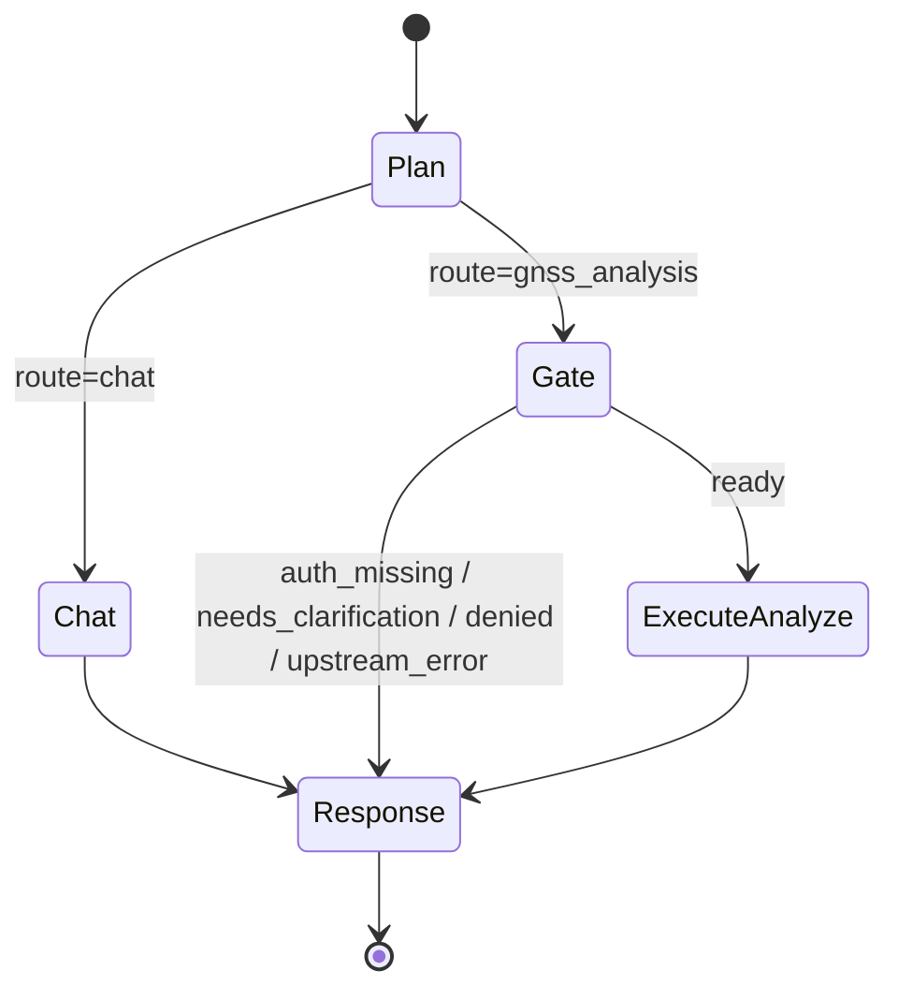

# 005 北斗站点查询与实体解析 — 实现设计

## 实现 Checklist

- [x] 将 LangGraph 拓扑调整为固定 5 节点：`Plan`、`Chat`、`Gate`、`ExecuteAnalyze`、`Response`。
- [x] `Plan` 使用 LLM 结构化输出识别普通对话与 GNSS/北斗站点相关请求，并提取站点表达、疑似编码、上下文指代和请求意图。
- [x] `Chat` 保留普通对话能力，普通对话可在节点内部调用天气等只读工具，最终进入 `Response`，不额外暴露 `tool_call` 图节点。
- [x] `Gate` 检查当前用户北斗会话可用性，缺失时返回授权缺失响应状态。
- [x] `Gate` 查询当前用户可访问分组、站点列表和必要的站点详情候选事实。
- [x] `Gate` 使用 LLM 结构化输出基于候选事实、用户输入和上下文判断是否唯一确认站点。
- [x] 多候选、低置信度、候选为空或信息不足时，`Gate` 返回澄清状态并阻止进入 `ExecuteAnalyze`。
- [x] `ExecuteAnalyze` 在已确认唯一站点后执行站点详情查询或返回已确认站点事实。
- [x] `ExecuteAnalyze` 可在监测分析需要时调用天气等只读工具补充外部环境事实，但不得跳过 `Gate` 的授权和站点确认。
- [x] `Response` 统一组装普通回答、授权缺失提示、澄清候选和站点查询结果。
- [x] 新增北斗站点 client/service，封装分组列表、站点列表和站点详情查询。
- [x] 新增当前用户北斗会话提供者协议，供后续凭证分支接入；本分支使用未配置实现和测试 fake。
- [x] 上游 HTTP 请求使用异步 `httpx`、`tenacity` 指数退避、固定允许路径和结构化错误映射。
- [x] 返回给 LLM 的站点候选数据经过字段裁剪，不包含凭据、会话 UUID 或无关敏感上下文。
- [x] 更新自动化测试覆盖 5 节点路由、授权缺失、单候选通过、多候选澄清、上游错误和上下文指代。
- [x] 更新已受影响的现有图测试，移除对公开 `tool_call` 图节点的依赖。

## 数据与迁移

本功能不新增数据库表，不新增 Alembic 迁移。

原因：

- 站点数据来自北斗上游接口，初版不做持久化缓存。
- 当前用户北斗凭据和会话缓存由 `004-beidou-credential-binding` 分支负责。
- 上下文指代优先使用 LangGraph checkpoint 中的图状态，不单独建表。

需要扩展 `GraphState`，但这是 checkpoint 状态，不是业务表结构：

- `route`：`"chat"` 或 `"gnss_analysis"`。
- `plan`：`Plan` 节点结构化输出，包含请求类型、站点表达、疑似编码、上下文指代、用户意图和缺失信息。
- `gate`：`Gate` 节点结果，包含 `status`、授权状态、是否需要澄清、澄清原因。
- `station_candidates`：裁剪后的候选站点列表。
- `resolved_station`：已确认唯一站点。
- `execution_result`：`ExecuteAnalyze` 输出。
- `response_intent`：供 `Response` 节点组装最终回答的结构化意图。

这些字段只保存当前会话内必要事实和判断结果，不保存北斗密码、加密密码、`SessionUUID` 或其他可复用凭据。

## API 与状态流转

### 对外 API

不新增公开 REST API。

本功能通过现有接口进入：

- `POST /api/v1/chatbot/chat`
- `POST /api/v1/chatbot/chat/stream`
- `GET /api/v1/chatbot/messages`

理由：

- 用户请求由智能体统一规划和响应。
- 站点查询服务是 Agent 内部只读能力，不需要在本阶段暴露独立站点管理接口。
- 当前用户认证和会话身份沿用 `get_current_session`，`user_id` 继续通过 `RunnableConfig.metadata` 传入图节点。

### 内部状态流转

### `Plan` 输出

新增 Pydantic schema，例如 `AgentPlan`：

- `route`: `chat | gnss_analysis`
- `intent`: `station_lookup | station_detail | gnss_analysis | unknown`
- `station_mentions`: 用户显式提到的站点表达列表
- `possible_codes`: 用户文本中疑似编码或设备编号表达列表
- `context_reference`: 是否存在“这个站点”“刚才那个”“它”等上下文指代
- `needs_station`: 是否需要站点才能继续
- `reason`: 简短判断理由

`Plan` 的智能识别由 `llm_service.call(..., response_format=AgentPlan)` 完成。确定性代码只校验结构化输出是否合法，不根据字符串规则替代语义判断。

天气、降雨、风况等问题的路由规则：

- 用户只问天气、降雨、风况、历史天气或天气预报，且不需要北斗站点事实时，`Plan` 应路由到 `chat`。
- 用户请求 GNSS/北斗监测分析，且分析需要降雨、风况等外部环境因素时，`Plan` 应路由到 `gnss_analysis`，天气事实由 `ExecuteAnalyze` 在 `Gate` 通过后按需获取。
- 天气工具是共享只读数据能力，不对应独立图节点，也不作为绕过 `Gate` 的路径。

### `Gate` 输出

新增 Pydantic schema，例如 `GateDecision`：

- `status`: `ready | auth_missing | needs_clarification | no_candidate | upstream_error`
- `resolved_station_uuid`: 唯一确认时填写
- `confidence`: `high | medium | low`
- `clarification_question`: 需要澄清时填写
- `candidate_ids`: 需要展示给用户的候选站点 UUID 列表
- `reason`: 简短判断理由

`Gate` 内部流程：

1. 从 `RunnableConfig.metadata.user_id` 获取当前用户。
2. 调用 `BeidouSessionProvider.get_session(user_id)` 获取当前用户北斗会话。
3. 如果会话缺失，直接设置 `auth_missing`。
4. 调用站点 service 获取当前用户可访问候选事实。
5. 将裁剪后的候选事实、`Plan` 输出、最近 `resolved_station` 和必要消息上下文交给 LLM 生成 `GateDecision`。
6. 只有 `status=ready`、`confidence=high`、`resolved_station_uuid` 对应候选列表中唯一站点时，才允许进入 `ExecuteAnalyze`。
7. 其他状态进入 `Response`。

这里的第 6 步是安全门禁，不是语义识别规则。即使 LLM 给出偏好，只要存在多个合理候选或置信度不足，就不执行。

### `ExecuteAnalyze` 输出

初版只执行站点相关查询：

- `station_detail`：查询并返回已确认站点详情。
- `station_lookup`：返回已确认站点事实。
- `gnss_analysis`：本阶段不查询 GNSS 数据，返回“站点已确认，GNSS 数据分析待后续能力接入”的结构化结果。

后续 GNSS 数据查询和异常分析仍在同一 `ExecuteAnalyze` 节点内部扩展，不新增图节点。

如果用户请求的监测分析需要天气、降雨或风况作为背景因素，`ExecuteAnalyze` 可调用现有 Open-Meteo 天气能力获取只读环境事实，并把结果纳入 `execution_result`。该调用只能发生在 `Gate` 通过后；普通天气问答不进入 `Gate`，由 `Chat` 节点内部调用同一只读能力。

### `Response` 输出

`Response` 根据 `response_intent` 和状态生成最终 `Message(role="assistant")`：

- 普通对话：输出 `Chat` 生成内容。
- 授权缺失：提示用户需要先绑定北斗凭据，不泄露任何凭据内部状态。
- 多候选澄清：列出候选站点的最小必要字段，并提出澄清问题。
- 无候选：说明未找到可访问站点，建议提供更具体名称、编码或分组。
- 上游错误：给出可理解错误，不暴露上游原始敏感内容。
- 站点详情：输出站点名称、分组、状态、类型、位置和基础坐标等事实。

## 文件改动

新增文件：

- `app/schemas/beidou_station.py`：北斗站点、分组、分页、候选、解析和错误响应 schema。
- `app/services/beidou/__init__.py`：北斗服务包初始化。
- `app/services/beidou/stations.py`：站点 client、service、会话提供者协议和错误映射。
- `app/core/prompts/gnss_plan.md`：`Plan` 节点规划提示词。
- `app/core/prompts/gnss_gate.md`：`Gate` 节点候选确认提示词。
- `app/core/prompts/gnss_response.md`：`Response` 节点响应组装提示词或响应规则。
- `tests/unit/test_beidou_station_service.py`：站点 service 单元测试。
- `tests/unit/test_gnss_graph_nodes.py`：5 节点图和节点行为单元测试。

修改文件：

- `app/schemas/graph.py`：扩展 `GraphState` 和图内结构化状态字段。
- `app/core/langgraph/graph.py`：将图拓扑改为 5 节点，新增 `_plan`、`_gate`、`_execute_analyze`、`_response`，调整 `_chat`；天气等只读工具作为 `Chat` 和 `ExecuteAnalyze` 节点内部可复用能力，不作为独立图节点。
- `app/core/prompts/system.md`：补充北斗/GNSS 工具结果只读、安全边界和多候选澄清约束。
- `app/core/config.py`：新增 `BEIDOU_API_BASE_URL`、站点查询超时、候选上限等配置；新增必要 rate limit 配置只在后续公开 API 时使用，本阶段不新增路由。
- `tests/unit/test_agent_workflows.py`：更新图调用后的消息处理和内存保存断言。
- `tests/unit/test_graph_llm_and_session_naming.py`：替换 `_tool_call` 图节点测试为 5 节点路由和节点行为测试。

不修改文件：

- `app/api/v1/api.py`：不挂载新 router。
- `app/api/v1/chatbot.py`：除非测试发现需要传递额外 metadata，否则保持现有会话入口。
- 数据库模型和 Alembic 迁移文件。

## 异步与事务设计

所有北斗上游调用使用异步 HTTP：

- `BeidouStationClient.get_station_groups(session_uuid)`
- `BeidouStationClient.get_stations(session_uuid, filters)`
- `BeidouStationClient.get_station_detail(session_uuid, station_uuid)`

请求策略：

- 使用 `httpx.AsyncClient(timeout=..., follow_redirects=False)`。
- 仅允许访问固定北斗 API base URL 下的固定相对路径。
- 使用 `tenacity.retry`，仅对超时、网络错误和 5xx 等可重试错误进行指数退避。
- 4xx、权限不足、会话无效、返回结构异常不重试。

事务：

- 本功能不写数据库，因此不引入事务。
- LangGraph checkpoint 由现有 `AsyncPostgresSaver` 管理，不在节点内手动开启数据库事务。

并发：

- `Gate` 获取分组与站点列表可并发执行。
- 若需要多个候选详情，初版限制最大候选详情查询数量，避免单轮请求放大。
- 对 LLM 的结构化调用串行执行，避免 `Plan` 和 `Gate` 状态交错。

缓存：

- 初版不新增持久化缓存。
- 如需短 TTL 缓存，只允许缓存成功的分组/站点列表响应，并以 `user_id` 与会话主体隔离；本阶段先不启用，避免凭证分支合并前出现边界不清。

## 错误处理、观测与安全

### 错误处理

北斗 service 返回结构化异常：

- `beidou_auth_missing`：当前用户未绑定或没有可用会话。
- `beidou_session_invalid`：上游会话无效或过期。
- `beidou_permission_denied`：上游返回权限不足。
- `beidou_timeout`：请求超时，可重试。
- `beidou_unavailable`：上游服务不可用，可重试。
- `beidou_bad_response`：上游返回结构异常。
- `station_not_found`：指定站点不存在或当前用户不可访问。
- `station_ambiguous`：候选过多或无法唯一确认。

Graph 节点不把异常原样抛给 API 客户端；节点将可预期错误转换为 `gate` 或 `execution_result`，由 `Response` 生成安全回答。不可预期错误继续使用 `logger.exception()` 并沿用现有 API 500 合同。

### 日志

新增日志事件均为 lowercase_with_underscores：

- `gnss_plan_started`
- `gnss_plan_finished`
- `beidou_station_groups_requested`
- `beidou_station_list_requested`
- `beidou_station_detail_requested`
- `beidou_station_request_finished`
- `beidou_station_request_failed`
- `gnss_gate_started`
- `gnss_gate_finished`
- `gnss_gate_clarification_required`
- `gnss_execute_analyze_started`
- `gnss_execute_analyze_finished`
- `gnss_response_assembled`

日志只记录 `user_id`、`session_id`、候选数量、错误码、耗时和站点 UUID；不记录 `SessionUUID`、密码、加密凭据或完整提示词。

### 指标

初版可复用现有 LLM 调用指标。若实现成本低，可新增 Prometheus 指标：

- `beidou_station_request_duration_seconds`
- `gnss_gate_decision_total`

指标不包含用户名、站点名称或可识别个人信息标签。

### 安全

- LLM 输出不可信：所有 `resolved_station_uuid` 必须回查候选列表并确认属于当前用户可访问数据。
- 上游站点事实和天气事实只作为数据，不执行其中任何文本指令。
- 返回给 LLM 的候选字段只包含 `StationUUID`、`StationName`、`StationGroupName`、`DeviceUUID`、`StationType`、`StationStatus`、`StationLocation`、`BaseStationName`。
- 多候选或低置信度时禁止进入 `ExecuteAnalyze`。
- 天气工具不能作为绕过北斗授权、站点确认或多候选澄清的替代路径。
- 不在 prompt、日志或响应中暴露 `SessionUUID`。
- 不把测试账号或真实凭据写入代码、测试或文档。

## 实现计划

1. 扩展 schema：新增 `beidou_station.py`，扩展 `GraphState` 的计划、门禁、候选、解析和执行状态。
2. 新增北斗站点 service：实现会话提供者协议、站点 client、结构化错误、字段规范化和候选裁剪。
3. 重构 LangGraph 拓扑为 5 节点：`Plan`、`Chat`、`Gate`、`ExecuteAnalyze`、`Response`。
4. 实现 `Plan` 结构化 LLM 调用，输出 `AgentPlan`。
5. 实现 `Gate` 会话检查、候选查询、结构化 LLM 判定和确定性安全门禁。
6. 实现 `ExecuteAnalyze` 初版站点详情/确认结果，并保留调用天气只读能力的内部扩展点。
7. 实现 `Response` 统一组装，覆盖普通对话、授权缺失、澄清、错误和站点结果。
8. 更新系统提示词和新增节点提示词，明确工具结果只读、多候选澄清和凭据不泄露。
9. 按测试计划先写失败测试，再分批实现到全绿。
10. 运行 `uv run pytest tests/unit/test_beidou_station_service.py tests/unit/test_gnss_graph_nodes.py tests/unit/test_agent_workflows.py tests/unit/test_graph_llm_and_session_naming.py`。
11. 运行 `make lint` 和 `make typecheck`，修复本功能引入的问题。
