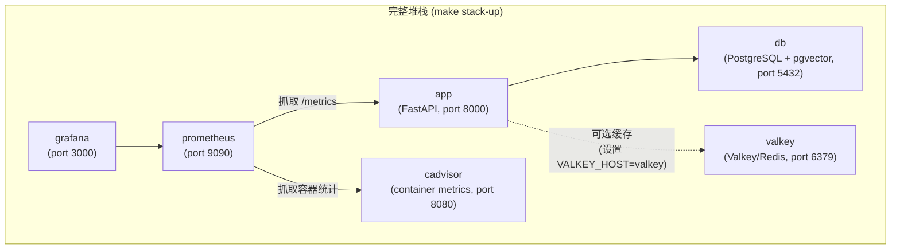

<div align="right"><a href="./docker.en-US.md">English</a></div>

# Docker

## 服务



Valkey 始终启动，但仅在您的 `.env` 文件中设置了 `VALKEY_HOST=valkey` 时被应用使用。未设置时，应用降级到内存缓存。

## 命令

### API + 数据库（开发中最常用）

```bash
make docker-up ENV=development     # 启动
make docker-down ENV=development   # 停止
make docker-logs ENV=development   # 跟踪日志
```

### 完整堆栈（包括 Prometheus + Grafana）

```bash
make stack-up ENV=development      # 启动所有服务
make stack-down ENV=development    # 停止所有服务
make stack-logs ENV=development    # 跟踪所有服务日志
```

### 构建自定义镜像

```bash
make docker-build ENV=production
```

这运行 `scripts/build-docker.sh`，为指定环境构建和标记镜像。

## 在 Docker 中运行迁移

`make docker-up` 后，针对容器化数据库运行迁移：

```bash
make migrate ENV=development
```

这从您的本地机器获取正确的 `.env` 文件并运行 `alembic upgrade head`，连接到容器化 PostgreSQL。

## 环境文件

每个环境需要一个 `.env.<env>` 文件：

```bash
cp .env.example .env.development
cp .env.example .env.staging
cp .env.example .env.production
```

`docker-up` 和 `stack-up` 命令通过 `--env-file` 将环境文件传递给 Docker Compose。确保您的 Docker 环境文件中 `POSTGRES_HOST=db`（不是 `localhost`）— Compose 网络内的服务名是 `db`。

## Grafana

`make stack-up` 后，Grafana 可通过 http://localhost:3000 访问。

默认凭据：`admin` / `admin`

预配置仪表板（在 `grafana/` 中）：

- API 性能（请求率、延迟、错误率）
- 限流统计
- 数据库连接池健康
- 系统资源使用
