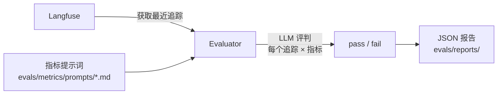

<div align="right">[\[English\]](./evaluation.en-US.md)</div>

# 评估

该模板包含一个基于指标的评估框架，从 Langfuse 获取追踪，使用 LLM 评判进行评分，并生成 JSON 报告。

## 运行评估

```bash
make eval                        # 交互模式 — 提示输入设置
make eval-quick                  # 使用默认值运行，无提示
make eval-no-report              # 运行但跳过报告生成
make eval ENV=production         # 针对生产追踪运行
```

## 工作原理



1. **获取追踪** — 从 Langfuse 拉取最近的 LLM 追踪（通过 `LANGFUSE_*` 环境变量配置）
2. **评分** — 对于每个追踪 × 指标组合，LLM 评判评估输出并返回 pass/fail
3. **报告** — 包含聚合统计和每个追踪结果的 JSON 报告保存到 `evals/reports/`

## 内置指标

| 指标 | 检查内容 |
| --- | --- |
| `helpfulness` | 响应是否真正帮助了用户？ |
| `conciseness` | 响应是否简洁得当？ |
| `hallucination` | 响应是否包含捏造的事实？ |
| `relevancy` | 响应是否切题？ |
| `toxicity` | 响应是否包含有害内容？ |

## 添加自定义指标

1. 在 `evals/metrics/prompts/` 中创建一个 markdown 文件：

```markdown
# My Metric

Evaluate whether the assistant response...

## Scoring

Return "pass" if... Return "fail" if...
```

2. 评估器自动发现并应用该目录中的所有 `.md` 文件。

## 报告格式

报告保存到 `evals/reports/evaluation_report_YYYYMMDD_HHMMSS.json`：

```json
{
  "summary": {
    "total_traces": 50,
    "success_rate": 0.92,
    "duration_seconds": 34.2
  },
  "metrics": {
    "helpfulness": {"pass": 48, "fail": 2, "rate": 0.96},
    "hallucination": {"pass": 45, "fail": 5, "rate": 0.90}
  },
  "traces": [...]
}
```

## 评估 LLM 配置

评估器使用单独的 LLM 配置，因此您可以使用不同的（更便宜的）模型进行评判：

```bash
EVALUATION_LLM=gpt-5
EVALUATION_API_KEY=...   # 如果未设置，默认为 OPENAI_API_KEY
```
