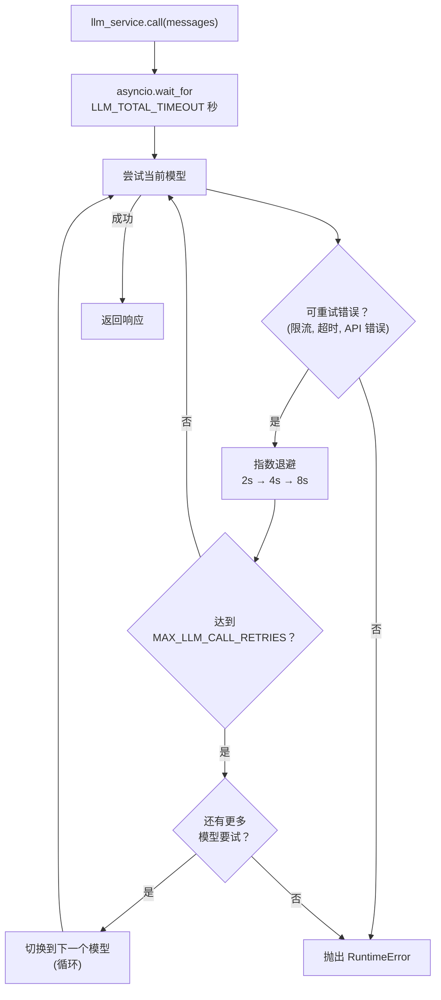

# LLM 服务

## 概述

LLM 服务（`app/services/llm/`）处理所有语言模型调用，具有自动重试、循环模型降级和总超时预算。您的 agent 代码调用 `llm_service.call(messages)` — 服务处理其他所有内容。

该包分为两个模块：

- `app/services/llm/registry.py` — `LLMRegistry`：定义可用模型
- `app/services/llm/service.py` — `LLMService`：调用逻辑、重试、降级、结构化输出

## 模型注册表

模型按优先级顺序在 `LLMRegistry.LLMS` 中定义：

| 名称 | 模型 | 说明 |
| --- | --- | --- |
| `gpt-5-mini` | gpt-5-mini | 默认。低推理成本。 |
| `gpt-5.4` | gpt-5 | 中等推理成本。 |
| `gpt-5.4-nano` | gpt-5.4-nano | 快速，低推理成本。 |
| `gpt-5` | gpt-5 | 完整模型，生产调优采样。 |

在 `.env` 中设置 `DEFAULT_LLM_MODEL` 以选择起始模型。

添加或更改模型，编辑 `app/services/llm/registry.py` 中的 `LLMRegistry.LLMS`。

## 重试和降级行为



**每模型重试配置**：

- 最大尝试次数：`MAX_LLM_CALL_RETRIES`（默认：3）
- 等待时间：指数退避，最小 2s，最大 10s
- 重试条件：`RateLimitError`、`APITimeoutError`、`APIError`

**总超时**：`LLM_TOTAL_TIMEOUT` 秒（默认：60s）限制整个循环。没有此限制，最坏情况是 `retries × models × max_wait` — 可能超过 2 分钟。

**降级顺序**：循环遍历 `LLMRegistry.LLMS`。在最后一个模型之后，循环回到第一个，并在一个完整周期后停止。

## 工具

工具在启动时绑定到 LLM：

```python
llm_service.bind_tools(tools)
```

在降级期间切换模型时，工具会自动重新绑定到新模型。

## 结构化输出

传递 Pydantic 模型作为 `response_format`，以获取经过验证的实例而不是原始 `BaseMessage`：

```python
from app.schemas.my_schema import MySchema

result: MySchema = await llm_service.call(
    messages,
    model_name="gpt-5.4-nano",   # 可选 — 省略时使用当前默认值
    response_format=MySchema,
    temperature=0.2,
)
```

服务在解析的模型上链接 `.with_structured_output(schema)`，并在每次降级尝试时重新包装，因此重试和模型切换透明工作。

## 添加新模型

```python
# app/services/llm/registry.py — LLMRegistry.LLMS
{
    "name": "gpt-5.4",
    "llm": ChatOpenAI(
        model="gpt-5.4",
        api_key=settings.OPENAI_API_KEY,
        max_tokens=settings.MAX_TOKENS,
    ),
},
```

在列表中的任意位置添加。降级顺序遵循列表顺序。
