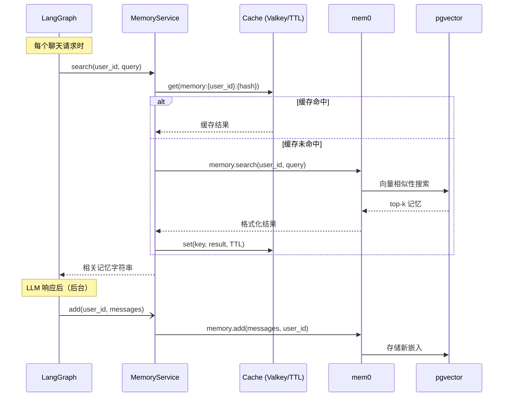

<a href="./memory.en-US.md">English</a>

# 记忆

## 概述

该模板包含由 mem0 和 pgvector 驱动的长期记忆系统。记忆从对话中提取，存储为向量嵌入，并在每个请求上语义检索 — 为 agent 提供过去会话的上下文。

## 工作原理

## 缓存层

记忆搜索结果被缓存，以避免在同一 TTL 窗口内对类似问题进行重复的 pgvector 查询。

- **有 Valkey/Redis**：缓存在应用实例间共享。在 `.env` 中设置 `VALKEY_HOST`。
- **无 Valkey**：降级到内存 `TTLCache` — 单实例运行良好。

缓存键：`memory:{user_id}:{sha256(query)[:16]}`
TTL：`CACHE_TTL_SECONDS`（默认：60s）

仅缓存成功且非空的结果。错误永不缓存。

## 记忆更新

LLM 生成响应后，记忆通过 `asyncio.create_task` 在**后台**更新。这意味着：
- 响应立即返回，不等待 mem0 完成
- 记忆更新不会阻塞或减慢聊天响应

## 配置

| 变量 | 默认值 | 描述 |
| --- | --- | --- |
| `LONG_TERM_MEMORY_COLLECTION_NAME` | `longterm_memory` | pgvector 集合名称 |
| `LONG_TERM_MEMORY_MODEL` | `gpt-5-nano` | mem0 用于提取和处理记忆的 LLM |
| `LONG_TERM_MEMORY_EMBEDDER_MODEL` | `text-embedding-3-small` | 语义搜索的嵌入模型 |
| `CACHE_TTL_SECONDS` | `60` | 记忆搜索缓存 TTL |

## 启动预热

在启动时，在应用生命周期中调用 `memory_service.initialize()`。这建立 pgvector 连接池并运行 mem0 的架构检查，因此第一个用户请求不需支付约 130ms 的冷启动成本。

## 每用户隔离

每个用户的记忆使用 `user_id` 作为命名空间独立存储和搜索。用户不能访问彼此的记忆。
