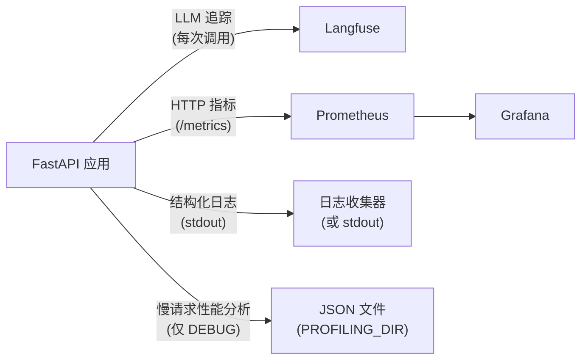

<div align="right">[\[English\]](./observability.en-US.md)</div>

# 可观测性

## 概述



---

## Langfuse — LLM 追踪

每个 LLM 调用都通过 LangChain `CallbackHandler` 进行追踪。追踪包括：

- 输入消息和输出
- 令牌使用量和成本
- 每次调用和每个会话的延迟
- 模型名称、温度和其他参数

**设置**：

```bash
LANGFUSE_TRACING_ENABLED=true
LANGFUSE_PUBLIC_KEY=pk-...
LANGFUSE_SECRET_KEY=sk-...
LANGFUSE_HOST=https://cloud.langfuse.com   # 或您的自托管 URL
```

**本地开发时禁用**：

```bash
LANGFUSE_TRACING_ENABLED=false
```

追踪也用作[评估框架](evaluation.md) 的数据源。

---

## 结构化日志

所有日志使用 structlog 的一致格式：

- **开发**：彩色控制台输出
- **生产**：JSON（传送到您的日志收集器）

每条日志行自动携带 `request_id`、`session_id` 和 `user_id`（可用时）— 由 `LoggingContextMiddleware` 绑定。

### 日志格式约定

```python
# 正确
logger.info("chat_request_received", session_id=session.id, message_count=5)

# 错误
logger.info(f"chat request received for {session.id}")  # 不要使用 f-strings
logger.error("something failed", error=str(e))          # 异常使用 logger.exception
```

规则：

- 事件名称使用 `lowercase_with_underscores`
- 变量作为关键字参数传递，从不内插到事件字符串中
- 在 `except` 块中使用 `logger.exception()`（而不是 `.error()`）— 保留完整堆栈跟踪

### 按环境划分的日志级别

| 环境 | 级别 |
| --- | --- |
| development | DEBUG |
| staging | INFO |
| production | WARNING |

---

## Prometheus 指标

指标在 `GET /metrics` 暴露，由 Prometheus 抓取。

| 指标 | 类型 | 描述 |
| --- | --- | --- |
| `http_requests_total` | Counter | 按方法、端点、状态统计的请求数 |
| `http_request_duration_seconds` | Histogram | 按方法、端点统计的请求延迟 |
| `llm_inference_duration_seconds` | Histogram | 按模型统计的 LLM 调用延迟 |
| `llm_stream_duration_seconds` | Histogram | 按模型统计的流式调用延迟 |
| `db_connections` | Gauge | 活跃数据库连接 |

Grafana 仪表板在 `grafana/` 中预配置。使用 `make stack-up ENV=development` 启动完整堆栈，在 http://localhost:3000（admin/admin）访问它们。

---

## 请求性能分析（仅调试）

`DEBUG=true` 时，`ProfilingMiddleware` 使用 pyinstrument 对每个请求进行性能分析。当请求超过 `PROFILING_THRESHOLD_SECONDS` 时，JSON 报告保存到 `PROFILING_DIR`。

每个报告文件以 `{request_id}.json` 命名，包含：

```json
{
  "request_id": "...",
  "endpoint": "POST /api/v1/chatbot/chat",
  "wall_time_ms": 1842,
  "cpu_time_ms": 145,
  "io_wait_ms": 1697,
  "memory_peak_kb": 4820,
  "top_memory_allocators": [...],
  "call_tree": {...}
}
```

设置 `PROFILING_THRESHOLD_SECONDS=0` 对每个请求进行性能分析。

文件名中的 `request_id` 与 `X-Request-ID` 响应头匹配，因此您可以关联特定日志行的性能分析。

---

## 请求 ID 传播

每个请求通过 `asgi-correlation-id` 获取唯一的 `X-Request-ID` 头。此 ID：

- 在响应头中返回
- 绑定到该请求的每个日志行
- 用作性能分析报告的文件名

使用响应中的 `X-Request-ID` 来 grep 日志、查找性能分析，以及查找该请求的 Langfuse 追踪。
