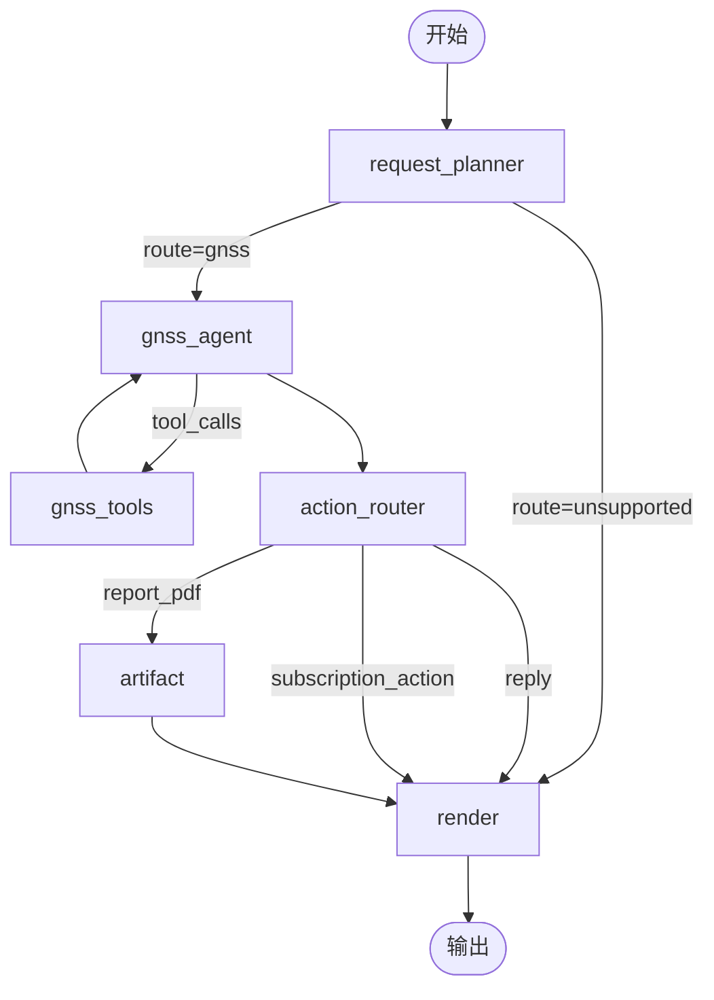
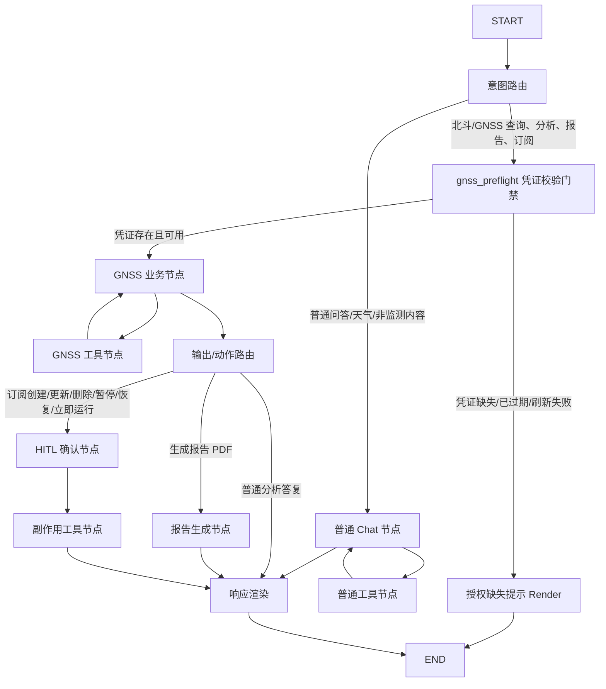
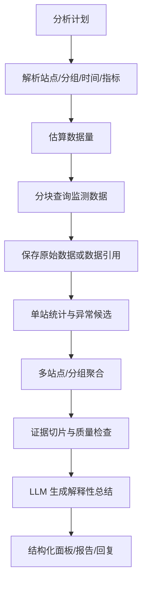

# 006 PRD 驱动的 Agent 图结构演进规划

## 背景总结

`docs/reference/prd.md` 要求系统从通用对话能力演进为面向滑坡监测的业务 Agent，核心能力包括：

- 用户级北斗凭据绑定、会话缓存和授权缺失提示。
- 普通对话、天气查询、北斗/GNSS 查询、监测分析、报告生成和订阅管理。
- 站点分组、站点列表、站点详情、GNSS 实时数据和日监测数据查询。
- 按站点名称、编码、别名、模糊表达和上下文指代做语义实体解析。
- 多站点、分组、时间范围、数据类型、采样参数和粒度驱动的监测数据分析。
- 异常候选分析、结构化面板、趋势图、异常卡、站点对比、报告 PDF 和邮件订阅。
- 对订阅创建、更新、删除、暂停、恢复、立即运行等副作用操作进行 HITL 确认。

当前代码已经实现了 GNSS/北斗站点查询的基础链路：



后续目标不应继续把所有能力堆进单一 `gnss_agent`。应按用户确认的图结构拆分普通对话、GNSS 凭证门禁、GNSS 业务、报告、HITL 和副作用工具边界。

## 目标图结构

后续演进应参考以下目标图结构：



### 与当前代码的映射

| 目标节点 | 当前实现对应 | 当前状态 | 演进方向 |
| --- | --- | --- | --- |
| `router` | `request_planner` | 已实现 `gnss/unsupported` 路由 | 扩展为 `chat/gnss`，并输出业务意图、动作风险和参数缺口 |
| `gnss_preflight` | 当前散落在 GNSS 工具执行时解析北斗会话 | 缺失 | GNSS 业务入口前检查当前用户是否有可用北斗凭据或可刷新会话；失败直接进入授权缺失提示 |
| `chat` | 目前没有独立普通 chat 节点 | 缺失 | 承载普通问答、天气、非监测内容 |
| `chat_tools` | 天气等只读工具目前可被 GNSS agent 使用 | 未独立 | 普通工具与 GNSS 工具分离；天气工具改为只接收经纬度的无鉴权纯地理工具 |
| `gnss` | `gnss_agent` | 已存在 | 聚焦北斗/GNSS 查询、分析、报告、订阅意图，不直接执行副作用 |
| `gnss_tools` | `gnss_tools` | 已存在站点工具 | 扩展为站点、GNSS 时序、日监测数据、分析数据准备工具；不再提供按站点直接查天气的北斗鉴权包装工具 |
| `action_router` | `action_router` | 已存在 | 明确区分普通分析答复、报告 artifact、订阅 HITL |
| `artifact` | `artifact` | 占位存在 | 生成 PDF 报告和下载 artifact |
| `hitl` | 当前未作为图节点落地 | 缺失 | 仅用于用户确认、业务补充和副作用审批 |
| `side_effect_tools` | 当前不执行订阅副作用 | 缺失 | 只在 HITL 确认后执行订阅写入、暂停、恢复、删除、立即运行 |
| `auth_render` / `render` | `render` | 部分已存在 | 输出授权缺失提示、文本、结构化面板、工具进度、错误状态、下载链接和下一步建议 |

## 节点边界

### 上下文读取原则

当前不再规划独立 `context` 图节点。

原因：

- 当前 `router` 已经会读取最近对话上下文，用于判断最后一条用户消息的真实业务意图。
- 后续 `chat`、`gnss`、`render` 等节点可以按需从 `GraphState`、checkpoint、长期记忆或结构化引用中读取自身需要的上下文。
- 单独增加 `context` 节点容易变成大对象汇聚点，诱导把工具 JSON、站点列表或监测序列提前塞入图状态。

边界：

- 上下文准备是一组按节点就近读取的能力，不是单独图节点。
- 任一节点都不得把完整上游响应、完整站点列表或完整监测序列写入 `messages`。
- 需要跨节点共享的事实必须结构化保存为计划、范围、摘要、引用或错误状态。

### `router` 意图路由

职责：

- 根据最新用户消息和最近历史消息判断进入 `chat` 还是 `gnss`。
- 输出结构化计划，至少包含 `route`、`intent`、`needs_station`、`needs_weather`、`needs_time_range`、`action_risk` 和 `reason`。
- 对“重新查询”“继续分析”“查刚才那个分组”等上下文依赖表达进行语义判断。
- 当路由结果为 GNSS 业务时，进入 `gnss_preflight`，而不是直接进入 `gnss`。

边界：

- 语义识别由 LLM 结构化输出完成。
- 确定性代码只校验 schema、合法枚举和状态流转。
- 不通过固定关键词规则替代语义判断。
- 不做北斗登录、不刷新 SessionUUID、不调用站点或监测数据工具。

### `gnss_preflight` 凭证校验门禁

职责：

- 在进入 `gnss` 业务节点前，根据当前 `user_id` 检查用户级北斗凭据状态。
- 对已绑定凭据尝试获取或刷新可用北斗会话；刷新成功后只把“可用”状态传给后续节点，不把 `SessionUUID` 放入 LLM prompt、`messages`、前端响应或日志。
- 当用户未绑定凭据、凭据解密失败、上游登录失败、会话刷新失败或用户上下文缺失时，直接进入授权缺失提示 Render。
- 输出结构化门禁结果，例如 `status`、`reason_code`、`retryable`、`user_action`。

边界：

- 只做轻量凭证可用性判断和必要的会话刷新，不查询站点列表或监测数据。
- 不生成业务分析答案。
- 不把系统异常伪装成 HITL；可重试上游失败应返回结构化错误或授权失效提示。
- 不取代 `gnss_tools` 的权限防线；GNSS 工具层仍必须基于当前用户上下文校验授权，防止绕过图节点直接调用工具。

### `chat` 与 `chat_tools`

职责：

- 处理普通问答、天气、非监测内容和不需要北斗授权的只读查询。
- 可调用天气等普通只读工具。
- 普通工具结果只回到 `chat`，不进入 GNSS 授权和站点解析链路。

边界：

- 不能调用北斗凭据、站点、GNSS 监测数据和订阅副作用工具。
- 如果用户从普通问答转入北斗/GNSS 查询，应由下一轮 `router` 路由到 `gnss`。

天气工具边界：

- `query_open_meteo_weather(latitude: float, longitude: float, ...)` 是无北斗鉴权的纯地理工具，属于普通只读工具能力。
- 该工具不得接受 `station_uuid`、站点名称、北斗 `SessionUUID` 或用户凭据作为输入。
- 普通天气查询如果用户直接给出经纬度或可由普通地理解析得到经纬度，可以直接调用该工具。

### `gnss` 与 `gnss_tools`

职责：

- 处理北斗/GNSS 站点查询、监测数据查询、分析、报告和订阅语义。
- 调用 GNSS 工具获取站点、分组、监测数据、聚合结果和分析数据准备结果。
- 对需要澄清的站点、时间范围、指标、粒度或分组范围生成结构化需求。

边界：

- `gnss` 不直接写数据库副作用。
- `gnss_tools` 只能执行只读或分析准备工具。
- 必须先做站点类型能力门禁；不适合 RTK/PJK 异常分析的站点只能返回受控说明或建议可执行的查询类型。
- 北斗 `SessionUUID` 不进入 LLM prompt、日志、前端响应或 `messages`。

站点天气组合调用：

- GNSS 业务节点需要查询特定站点天气时，必须先调用北斗只读工具 `get_beidou_station_detail(station_uuid)` 获取站点经纬度。
- 拿到经纬度后，再调用无鉴权的 `query_open_meteo_weather(latitude, longitude, ...)` 获取天气事实。
- 不再提供 `get_beidou_station_weather(station_uuid)` 这类把北斗站点读取和天气查询包在一起的工具；这会模糊鉴权边界，也会让普通天气查询误入北斗授权链路。
- 如果站点详情缺少可用经纬度，应返回结构化缺口说明，不应让天气工具猜测站点位置。

### `action_router`

职责：

- 判断 GNSS 节点输出应进入普通渲染、报告生成还是 HITL。
- 报告 PDF 进入 `artifact`。
- 订阅创建、更新、删除、暂停、恢复、立即运行进入 `hitl`。
- 普通分析答复进入 `render`。

边界：

- 不生成最终业务回答。
- 不执行副作用。
- 不把需要确认的动作直接发给工具。

### `artifact`

职责：

- 基于已完成的结构化分析结果生成报告 PDF。
- 生成下载 artifact、报告元数据和可追溯数据引用。
- 报告生成应作为可恢复后台任务运行，返回 `task_id`、`artifact_id`、状态、过期时间和下载权限信息。

边界：

- 不重新解释用户意图。
- 不直接查询未授权数据。
- 不把大体量原始数据嵌入 `GraphState.messages`。
- 不依赖临时内存中的原始数据生成可审计报告；报告所需数据必须能通过 `dataset_ref` 持久读取或确定性重算。

### `hitl` 与 `side_effect_tools`

职责：

- `hitl` 展示订阅或副作用操作的确认信息。
- 用户确认后，`side_effect_tools` 执行数据库写入、暂停、恢复、删除或立即运行。
- 待确认动作必须包含 `action_id`、动作摘要、结构化参数、发起用户、会话、过期时间和幂等键。

边界：

- 只有显式等待用户确认、补充或审批时才能进入 HITL。
- 系统异常、上游失败、上下文超预算、响应组装失败不得伪装成 HITL。
- 用户确认前不得写订阅表、发送邮件或立即运行任务。
- 用户确认时必须校验当前用户、会话、`action_id`、动作版本和过期时间；校验失败只能重新生成确认，不得执行旧动作。

### `render`

职责：

- 统一输出用户可见文本、结构化面板、图表、下载链接、错误状态和下一步建议。
- 将工具进度、分析进度和错误状态转换为前端可消费结构。
- 对业务分析回复，优先基于结构化事实调用响应组装能力生成自然语言；固定文案只用于系统级兜底、能力边界和短错误提示。

边界：

- 不执行工具。
- 不访问上游。
- 不生成未经 schema 校验的前端可执行代码。

## 监测数据规模与分析策略

### 已确认业务事实

- 站点列表规模相对可控：每个分组通常几十个站点，请求是分页的。
- 站点监测数据为每个站点每小时 1 条。
- 常见分析周期按月。
- 用户可能要求分析一个站点、多个站点、一个分组或多个分组。
- 月度分析默认采用 `Asia/Shanghai` 业务时区下的上一个完整自然月。例如当前为 7 月 1 日时，默认分析 6 月 1 日 00:00 至 7 月 1 日 00:00 前；非月初阶段可额外支持“本月至今 (MTD)”快捷选项。
- 多站点或分组分析默认指标为水平位移残差 (H residual) 和垂向位移残差 (U residual)，以毫米表达。
- 当站点数大于 10 个，或估算时序行数大于 5,000 条时，应触发长任务提示；目标是保证同步 HTTP 响应在 5 秒内完成，后续分析和报告 PDF 由后台异步生成，并优先复用当前 SSE/消息卡片/轮询能力通知用户，WebSocket 作为后续可选增强。
- 分组分析在对话窗口默认输出“分组概览趋势 + 异常站点 Top 3 + 核心结论”，其余站点细节进入 PDF 下载。
- `station_summaries` 必须包含 `missing_ratio`；缺测率大于 20% 时，LLM 输入应附带“数据置信度低”标识，避免把停电、设备故障或滑坡诱发的数据缺口误判为平稳趋势。

按上述事实估算：

| 分析范围 | 估算数据量 |
| --- | --- |
| 单站 1 个月 | 约 24 × 30 = 720 条 |
| 10 个站点 1 个月 | 约 7,200 条 |
| 30 个站点 1 个月 | 约 21,600 条 |
| 2 个分组，每组 30 个站点，1 个月 | 约 43,200 条 |

这类规模不适合直接作为 LLM message 输入，但适合通过后端分块查询、结构化存储、统计聚合和证据切片完成分析。

### 数据处理原则

1. **站点列表不是主要瓶颈**  
   分组下几十个站点的列表可以完整查询并结构化保存，但仍不应把完整上游响应塞入 LLM prompt。

2. **监测时序数据必须引用化**  
   原始 GNSS 时序和日监测数据应保存到数据库、缓存、对象存储或临时 artifact，并在 `GraphState` 中保存 `dataset_ref`，不要保存完整 raw rows。
   若数据将用于 PDF、订阅运行历史或审计追溯，不能只依赖短 TTL 缓存；必须落到可恢复的持久存储，或保存足够的查询参数和版本信息以确定性重算。

3. **分析以分块和聚合为主**  
   多站点或分组分析应按站点和时间窗口分块查询，先生成每站摘要，再生成分组级摘要。

4. **LLM 只看摘要和证据切片**  
   LLM 输入应包含分析目标、统计摘要、异常候选、关键证据窗口和数据质量说明，不包含完整原始序列。

5. **可追溯性必须保留**  
   用户看到的趋势、异常候选、报告结论都应能追溯到 `dataset_ref`、站点、指标、时间窗口和证据行范围。

6. **大范围请求不是错误，但要有执行策略**  
   一个分组或多个站点的月度分析是正常业务场景，不应因为数据量超过 LLM 上下文而拒绝。只有缺少关键参数、超过系统配置上限或涉及副作用时才需要澄清或确认。

### 推荐分析流水线



### 单站分析

适用场景：

- 用户指定一个监测点。
- 用户追问刚才某个站点。
- 用户请求站点详情、近期趋势或单站异常候选。

处理方式：

- 查询该站点目标时间范围内的完整数据。
- 计算 N、E、U、H、D3、residual 等指标摘要。
- 检测突变、阶跃、漂移、噪声突增和数据缺口。
- `GraphState` 保存分析摘要、异常候选和 `dataset_ref`。

### 多站点分析

适用场景：

- 用户指定多个站点。
- 用户要求对比多个站点。
- 用户从站点列表中选择若干对象继续分析。

处理方式：

- 每站独立分块查询和计算摘要。
- 生成站点级 `station_summary` 列表。
- 生成排序结果，例如最大水平位移、最大垂向变化、异常候选数量、数据缺口比例。
- LLM 只读取 top N 摘要、异常候选和必要证据切片。

### 分组分析

适用场景：

- 用户要求分析某个分组。
- 用户要求分析多个分组。
- 用户要求生成分组月报。

处理方式：

- 先解析分组，再获取分组下完整站点集合。
- 估算站点数、时间范围、指标数量和行数。
- 以站点为基本分片并发或批量查询。
- 对每站生成摘要，再做分组级聚合。
- 对异常候选只保留排序后的重点候选和证据引用。
- 报告或面板中展示分组概览、异常排名、数据缺口、重点站点趋势和后续建议。

## GraphState 保存边界

`GraphState` 应保存“状态、引用、摘要、证据索引”，不保存“完整原始监测数据”。

建议字段：

| 字段 | 保存内容 | 不应保存 |
| --- | --- | --- |
| `messages` | 用户和助手可见文本 | 工具原始 JSON、完整站点列表、完整监测序列 |
| `context` | 最近对话摘要、用户偏好、轻量会话上下文；这是状态字段，不是独立图节点 | 北斗 `SessionUUID`、密码、长工具结果 |
| `plan` | route、intent、分析类型、动作风险、参数缺口 | 自然语言大段模板 |
| `gnss_preflight` | 北斗凭据门禁结果、失败原因、可重试性、建议用户动作 | 北斗 `SessionUUID`、密码、解密后的凭据 |
| `resolved_scope` | 已确认站点 ID、分组 ID、站点数量、站点类型、能力门禁结果、时间范围、指标、粒度 | 上游完整响应 |
| `data_requirements` | 数据类型、时间范围、估算行数、查询分片计划 | raw rows |
| `dataset_refs` | 原始数据集引用、缓存 key、artifact id、行数、时间覆盖 | 原始监测数据明细 |
| `analysis_progress` | 当前阶段、已完成站点数、失败站点数、耗时 | 每条数据处理日志 |
| `station_summaries` | 每站统计摘要、质量摘要、异常候选计数 | 每小时原始数据 |
| `group_summary` | 分组聚合摘要、排名、数据质量概览 | 全量站点明细 |
| `evidence_refs` | 异常候选对应的站点、指标、时间窗口、数据行范围 | 完整证据数据 |
| `execution_result` | 本轮执行的结构化结果和下一步建议 | 未裁剪的大对象 |
| `ui_artifacts` | 表格、趋势图、异常卡、报告下载链接 | 未经 schema 校验的前端代码 |
| `pending_action` | 需要 HITL 的订阅或副作用操作 | 已确认前的执行结果 |
| `background_tasks` | 报告、长分析、订阅立即运行等后台任务 ID、状态、进度、artifact 引用 | 后台任务内部日志或原始数据 |
| `error_state` | 错误码、可重试性、用户可见说明 | 上游敏感原文 |

### 数据引用建议

`dataset_refs` 建议包含：

```json
{
  "dataset_id": "uuid",
  "kind": "gnss_hourly",
  "scope": {
    "station_ids": ["..."],
    "group_ids": ["..."],
    "time_range": {
      "start": "2026-06-01T00:00:00+08:00",
      "end": "2026-07-01T00:00:00+08:00",
      "end_inclusive": false
    },
    "metrics": ["H_residual", "U_residual"]
  },
  "row_count": 21600,
  "storage": "cache_or_artifact",
  "expires_at": "2026-07-02T00:00:00+08:00"
}
```

`station_summaries` 建议保存每站的轻量摘要：

```json
{
  "station_id": "uuid",
  "station_name": "北坡 GNSS 01",
  "row_count": 720,
  "time_coverage": "complete",
  "missing_ratio": 0.0,
  "max_horizontal_mm": 12.4,
  "max_vertical_mm": 4.1,
  "confidence": "normal",
  "trend": "slow_drift",
  "candidate_count": 2,
  "evidence_refs": ["evidence-001", "evidence-002"]
}
```

## 参数缺失与澄清边界

应澄清：

- 未能唯一确认站点或分组。
- 用户要求非默认周期分析但缺少时间范围，且无法从上下文推断。
- 用户要求特定指标但表达不清。
- 用户要求订阅、删除、暂停、恢复、立即运行等副作用但缺少确认。
- 请求范围超过同步执行上限，需要用户确认后台长任务或缩小范围。

不应澄清：

- 只是因为站点列表超过固定 20 条。
- 只是因为监测数据无法塞进 LLM 上下文。
- 已有明确分组、时间范围和分析目标的月度分组分析。

长任务提示不是错误兜底，也不等同于订阅副作用 HITL。它应向用户说明估算范围、预计耗时、后台执行方式、可取消性和结果通知方式；用户确认后只创建后台任务记录，不直接改动订阅、发送邮件或生成不可撤销外部副作用。

## 天气工具改造边界

目标工具签名：

```python
query_open_meteo_weather(latitude: float, longitude: float, ...)
```

设计要求：

- 天气工具只根据经纬度查询 Open-Meteo 或等价天气数据源，不依赖北斗 `SessionUUID`、本地 `user_id` 或北斗凭据。
- 天气工具输入 schema 必须拒绝 `station_uuid`、站点名称、北斗账号、密码、`SessionUUID` 等北斗字段。
- 普通天气请求走 `chat` / `chat_tools`；北斗站点天气请求走组合调用：`gnss_preflight` 通过后，`gnss` 先调用 `get_beidou_station_detail(station_uuid)`，再用返回的经纬度调用 `query_open_meteo_weather(latitude, longitude, ...)`。
- `get_beidou_station_detail` 属于 GNSS/北斗只读工具，必须保留用户级北斗凭证校验；`query_open_meteo_weather` 属于无鉴权纯地理工具，不得因为普通天气查询触发北斗授权缺失。
- 工具结果进入 LLM 前必须结构化裁剪，只保留分析需要的天气摘要、时间范围、降雨量、降雨概率、风速等事实字段。

## 后台任务与通知边界

- 第一阶段优先复用现有 `chat/stream` SSE、会话消息卡片和轮询查询任务状态；只有在实时多任务推送成为明确需求后，再新增 WebSocket 通道。
- 后台任务最小状态应包含 `task_id`、`kind`、`status`、`progress`、`session_id`、`user_id`、`created_at`、`updated_at`、`expires_at`、`artifact_id`、`error_code` 和 `retryable`。
- 报告 PDF、长范围分组分析和订阅立即运行都应进入后台任务模型，但任务类型和副作用权限不同：报告任务只生成 artifact；订阅立即运行会发送邮件，必须先经过 HITL。
- 用户取消生成只取消当前流式回复或尚未开始的后台任务；已经完成的数据引用和审计记录不应被静默删除。

## HITL 与幂等边界

- `pending_action` 必须持久保存到当前会话或专用待确认表，不能只存在于 LLM 输出文本或前端卡片中。
- 确认卡片展示给用户的是动作摘要；真正执行使用服务端保存的结构化参数和幂等键。
- 确认、拒绝和过期都必须写入审计日志；重复确认同一个幂等键只能产生一次副作用。
- 工具审批、业务澄清和订阅副作用确认可以共用前端卡片样式，但后端状态类型必须区分，避免把系统异常伪装成人工确认。

## 已确认业务决策

以下问题已由用户在 2026-07-01 确认，后续 spec/design/test 应按这些规则展开：

- 月度分析默认时间范围：`Asia/Shanghai` 业务时区下的上一个完整自然月，内部推荐使用左闭右开时间区间；非月初阶段可额外提供“本月至今 (MTD)”快捷选项。
- 多站点或分组默认指标：水平位移残差 (H residual) 和垂向位移残差 (U residual)，以毫米表达。
- 长任务阈值：站点数大于 10 个，或估算时序行数大于 5,000 条时触发长任务提示；同步 HTTP 响应目标控制在 5 秒内，通知通道优先复用 SSE、消息卡片和轮询。
- 分组分析默认输出粒度：对话窗口只输出“分组概览趋势 + 异常站点 Top 3 + 核心结论”，其余站点细节放入 PDF。
- GNSS 数据质量处理：`station_summaries` 增加 `missing_ratio`；缺测率大于 20% 时，LLM 输入附带“数据置信度低”标识。
- 报告 PDF 生成方式：后台异步生成。
- 订阅立即运行：不复用报告生成流程，而是单独生成邮件内容；确认状态必须持久化并使用幂等键防止重复发送。
- 目标图不再包含独立 `context` 节点；上下文由 `router` 和后续业务节点按需读取。
- GNSS 业务入口前增加 `gnss_preflight` 凭证校验门禁；凭证缺失、过期或刷新失败时直接进入授权缺失提示，不让模型进入无效工具重试。
- 天气查询工具改为无北斗鉴权的纯经纬度工具；特定站点天气必须通过 `get_beidou_station_detail` 与 `query_open_meteo_weather` 组合调用实现。

后续实现时不得通过 prompt 或硬编码临时文案绕过这些业务规则；如需改变阈值、指标或输出粒度，应先更新本规划和对应 spec/design/test。

## 报告与订阅运行语义

- 报告 PDF 属于后台生成任务。对话内可先返回结构化分析摘要、进度卡片或下载占位，PDF 完成后优先通过当前 SSE、会话消息卡片或轮询结果通知用户下载；WebSocket 仅作为后续增强选项。
- 邮件订阅是用户通过自然语言设定的定时通知任务。智能体应把用户原始订阅诉求转成结构化订阅配置，并保存原始意图、运行频率、收件邮箱来源和待执行问题生成策略。
- 订阅到期运行时，系统不应简单复用用户原文。应由智能体根据用户的订阅原始内容生成本次真正运行的提问，例如分析当天数据是否有异常、查询监测点状态或生成周期性摘要。
- 订阅立即运行属于副作用操作，必须经过 HITL 确认；确认后单独执行邮件内容生成和发送，不等同于生成报告 PDF。
- 订阅创建、更新、删除、暂停、恢复和立即运行的确认必须绑定服务端 `pending_action`；前端卡片只传递确认/拒绝意图，不传递可被篡改的完整执行参数。
- 订阅调度必须使用数据库锁或等价机制避免多实例重复执行，并记录运行历史、失败原因和可重试状态。

## 分阶段规划

### 阶段 1：对齐目标图并稳定当前能力

- 先保持当前 `request_planner` 节点名可兼容运行，只在文档和 schema 语义上向目标 `router` 收敛；实际重命名或 `route=chat` 迁移应单独设计并覆盖历史 checkpoint 兼容。
- 不新增独立 `context` 节点；保持 router 读取最近对话上下文，后续节点按需读取自己的上下文。
- 规划并实现轻量 `gnss_preflight` 门禁，GNSS 路由先检查用户级北斗凭据是否可用。
- 保留当前 `gnss_agent` 和 `gnss_tools`，继续承载站点分组、列表、详情查询。
- 新增或规划 `chat`、`chat_tools` 的职责边界，但不在本阶段强行拆分普通对话链路。
- 补齐 `auth_missing`、未知工具、上游超时重试、planner 异常兜底测试。

### 阶段 2：拆分普通工具与 GNSS 工具

- 将 `query_open_meteo_weather` 改造为 `latitude` / `longitude` 入参的纯地理工具，进入普通工具能力；移除或废弃 `get_beidou_station_weather(station_uuid)` 包装工具。
- 普通天气、普通问答工具进入 `chat_tools` 或共享只读普通工具集合。
- 北斗站点、GNSS 数据、分析准备进入 `gnss_tools`。
- 普通问答不再进入北斗授权链路。
- 特定站点天气通过 `get_beidou_station_detail` 获取经纬度后组合调用 `query_open_meteo_weather`。

### 阶段 3：接入 GNSS 小时数据与月度分析

- 新增 GNSS 小时数据查询工具。
- 支持单站、多站点、单分组、多分组分析。
- 实现 `dataset_refs`、`station_summaries`、`group_summary`、`evidence_refs`。
- 默认分析上一个完整自然月，默认指标为 H residual 和 U residual。
- 站点数大于 10 个或估算时序行数大于 5,000 条时触发后台长任务提示。
- 加入站点类型能力门禁和 `Asia/Shanghai` 时间边界处理。
- 在 `station_summaries` 中记录 `missing_ratio`，缺测率大于 20% 时标记低置信度。
- LLM 只接收摘要和证据切片。

### 阶段 4：结构化面板与异常候选

- 生成趋势图、指标摘要、异常卡、时间线、站点对比和异常排名。
- 异常候选采用规则型、可解释、可复核检测器。
- 模型不得把候选直接表述为最终灾害结论。

### 阶段 5：后台任务、报告 PDF、HITL 与副作用工具

- 建立后台任务状态模型，覆盖报告 PDF、长分析和订阅立即运行。
- 报告 PDF 进入后台异步 `artifact` 任务，完成后优先通过 SSE、消息卡片或轮询通知用户下载。
- 订阅创建、更新、删除、暂停、恢复、立即运行进入 `hitl`。
- HITL 确认状态持久化，校验用户、会话、动作版本、过期时间和幂等键后才进入 `side_effect_tools`。
- 订阅立即运行单独生成邮件内容；订阅定时运行时由智能体根据原始订阅诉求生成真正执行的问题，再执行查询/分析并发送邮件。
- 订阅调度必须具备数据库锁或等价机制、运行历史、失败原因和可重试状态。
- 用户确认前不写订阅表、不发送邮件、不立即运行任务。

## 文档与实现关系

- `docs/reference/prd.md`：产品目标和领域规则。
- `docs/specs/005-beidou-station-resolution.md`：当前代码已落地的站点查询和上下文 planner 能力。
- 本文档：目标图结构、数据分析边界、state 保存边界和后续路线。
- `docs/project-status.md`：记录用户确认的关键业务理解，避免后续代理重复误解。

后续新增能力仍应按 `docs/specs/{编号}.md`、`docs/designs/{编号}.md`、`docs/tests/{编号}.md` 拆分，不应把完整 PRD 一次性塞进一个实现分支。
