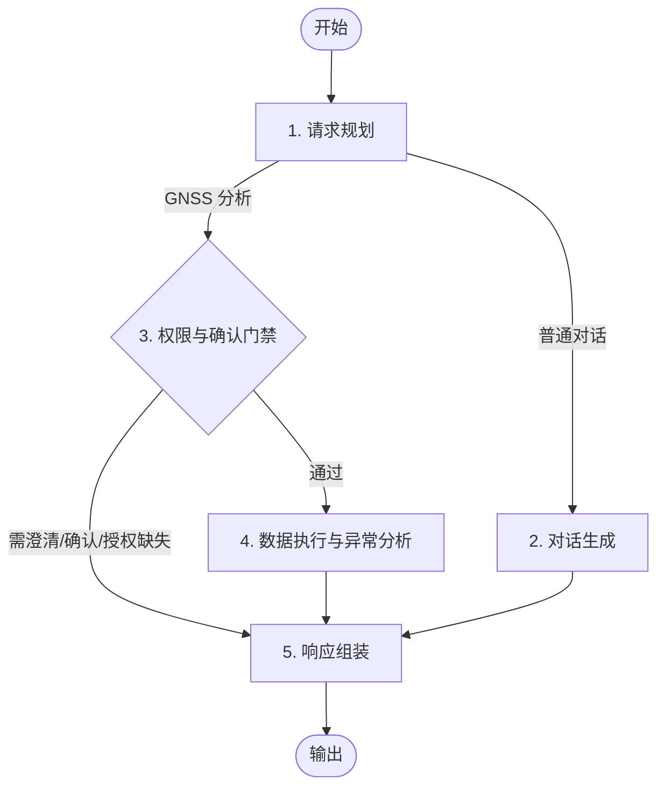

# 005 北斗站点查询与实体解析

## 背景

项目后续需要基于固定的 5 节点智能体图结构处理 GNSS 分析类请求：

本功能是 GNSS 分析能力的第一阶段基础：让智能体能使用当前用户可访问的北斗分组、站点列表和站点详情事实数据，并在对话中理解用户提到的站点实体。

当前凭证绑定能力正在独立分支实现。本功能不实现凭证保存、绑定、加密或刷新逻辑，但必须为后续接入“当前用户凭据/会话提供者”预留边界。

## 目标

1. 固定使用上述 5 节点图结构，不新增 `ResolveStation`、`StationLookup` 等额外图节点。
2. 使用当前用户凭据查询北斗监测平台分组、站点列表和站点详情；本阶段只定义和使用凭据/会话提供者边界，不实现凭证绑定能力。
3. 建立站点候选解析能力，支持名称、模糊名称、编码和上下文指代的第一版解析。
4. 站点实体识别、模糊表达理解、编码含义判断和上下文指代消解必须由智能体完成，不使用固定字符串规则替代智能识别。
5. 确定性代码只负责事实数据获取、响应结构校验、权限/授权缺失判断、候选数据裁剪、安全边界和多候选阻断。
6. 多候选、低置信度或信息不足时返回澄清数据，由 `Response` 节点组装澄清问题，不武断选择。
7. 为后续 GNSS 数据查询和异常分析保留 `ExecuteAnalyze` 扩展点；本阶段只实现站点查询与实体解析相关执行结果。

## 非目标

1. 不实现北斗凭证绑定、解绑、加密存储、会话刷新或凭据管理 API。
2. 不实现 GNSS 实时数据、日监测数据查询。
3. 不实现位移异常分析、告警判定、报告生成或订阅任务。
4. 不新增前端页面。
5. 不新增数据库表或 Alembic 迁移，除非后续 design 阶段发现当前上下文指代必须持久化且用户确认。
6. 不用固定规则完成站点语义识别；UUID 格式、响应字段、候选数量等安全校验不属于语义识别。

## 技术方案

初版围绕固定 5 节点图实现：

- `Plan`：由 LLM 判断请求是普通对话还是 GNSS/北斗站点相关请求，并从用户输入与对话上下文中抽取站点表达、疑似编码、分析意图和必要上下文。这里承担智能识别，不引入规则解析器替代语义判断。
- `Chat`：处理普通对话，维持现有聊天能力。
- `Gate`：检查当前用户是否有可用北斗凭据/会话；调用站点查询能力获取当前用户可访问的事实候选；让智能体基于候选、用户输入和上下文判断是否可唯一确认站点。若授权缺失、候选为空、多候选或低置信，进入 `Response`。
- `ExecuteAnalyze`：当 `Gate` 已确认唯一站点后，执行站点详情查询或返回已确认站点事实，为后续 GNSS 数据查询和异常分析保留同一节点内的扩展入口。
- `Response`：统一组装普通回答、授权缺失提示、候选澄清数据、站点查询结果和执行结果。

服务边界：

- 新增北斗站点 client/service，封装上游 `getStationGroupListInfo.php` 和 `getStationListInfo.php`。
- 站点详情通过 `getStationListInfo.php` 携带 `StationUUID` 查询并规范化为单站点详情；若上游返回多个或为空，由服务返回结构化错误。
- 新增当前用户北斗会话提供者协议，生产实现后续接入凭证分支；测试使用 fake provider。
- 对上游请求使用异步 HTTP、`tenacity` 指数退避和结构化日志。
- 返回给智能体的候选数据必须裁剪，只包含解析和澄清必要字段，避免把无关或敏感信息塞入提示词。

安全与智能体边界：

- LLM 输出视为不可信，只能作为候选判断和响应组织依据，不能绕过当前用户权限、凭据检查或候选确认门禁。
- 多候选时即使 LLM 给出偏好，也不得直接执行分析；必须返回澄清数据。
- 上游站点事实数据是只读数据，不作为可执行指令。

## 验收

- [ ] 图结构保持为 `Plan -> Chat/Gate -> ExecuteAnalyze/Response -> END`，不新增站点解析专用图节点。
- [ ] 当前用户无北斗凭据/会话时，GNSS/站点相关请求进入 `Response` 并返回授权缺失提示。
- [ ] 当前用户有凭据/会话时，可查询分组列表、站点列表和指定站点详情。
- [ ] 名称、模糊名称、编码和上下文指代由智能体基于用户输入、对话上下文和站点候选事实完成识别。
- [ ] 确定性代码不以固定字符串规则替代站点语义识别。
- [ ] 单一高置信候选时，`Gate` 可通过并进入 `ExecuteAnalyze` 返回站点详情或确认结果。
- [ ] 多候选、低置信度、候选为空或信息不足时，返回结构化澄清数据，不自动选择。
- [ ] 北斗上游失败、超时、权限不足和返回格式异常时，返回结构化错误并记录 lowercase_with_underscores 结构化日志。
- [ ] 自动化测试覆盖 happy path、多候选澄清、授权缺失、上游错误和上下文指代。

## 待确认问题

无。
