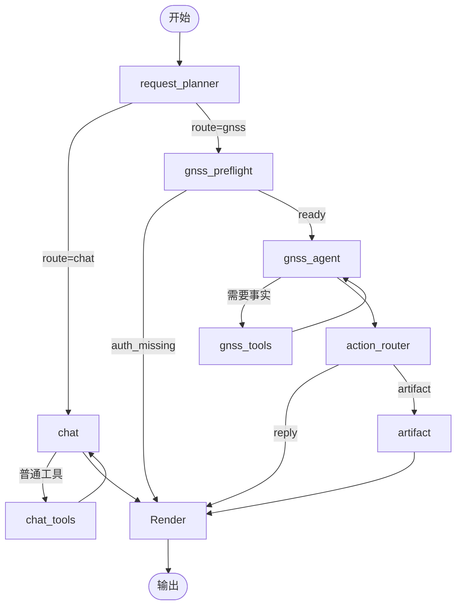

# 005 北斗站点查询与实体解析

## 背景

当前项目已将滑坡监测智能体收敛为一条区分普通聊天与 GNSS/北斗业务的 LangGraph 工作流。用户通过现有聊天接口提出站点、分组、数量、详情、天气辅助分析、报告或订阅相关请求时，由请求规划节点判断进入普通 `chat` 还是 GNSS 业务；GNSS 业务先经过 `gnss_preflight` 凭证门禁，再由 GNSS agent 使用受控只读工具读取事实并生成回复。

本功能以当前代码实现为准，覆盖北斗站点分组、站点列表、站点详情、上下文指代意图识别和只读工具安全边界。

当前图结构：

## 目标

1. `request_planner` 使用 LLM 结构化输出识别 `chat` 与 `gnss`，并输出 `AgentPlan`。
2. `request_planner` 基于最近用户/助手消息判断最后一条用户消息的真实意图，支持“重新查询”等上下文依赖表达。
3. 普通天气、闲聊和非 GNSS 内容进入 `chat`/`chat_tools`，不触发北斗凭据校验。
4. GNSS/北斗业务进入 `gnss_agent` 前必须经过 `gnss_preflight`；凭证缺失、用户上下文缺失或刷新失败时直接进入 `render`。
5. `gnss_agent` 只处理站点、GNSS 查询、监测分析、报告和订阅相关请求；需要事实时只能调用受控只读工具。
6. `gnss_tools` 在当前用户上下文中执行北斗站点分组、站点候选和站点详情工具，不接受或暴露 `SessionUUID`。
7. 特定站点天气必须组合调用：先 `get_beidou_station_detail(station_uuid)` 获取经纬度，再调用普通无鉴权天气工具 `query_open_meteo_weather(latitude, longitude, ...)`。
8. 北斗站点 service 使用当前用户北斗会话调用固定上游接口，规范化分组、站点列表和站点详情。
9. 站点列表默认使用上游 `PageSize=-1` 获取全部可访问站点；候选投影不再按固定 20 条截断。
10. 返回给 LLM 的站点候选只保留必要字段，不包含凭据、会话 UUID 或上游原始响应全文。
11. 上游失败、权限不足、会话无效、超时和返回结构异常映射为结构化错误，并记录 lowercase_with_underscores 结构化日志。

## 非目标

1. 不新增公开站点管理 REST API。
2. 不新增数据库表或 Alembic 迁移。
3. 不实现 GNSS 实时数据、日监测数据查询。
4. 不实现位移异常判定、报告 PDF 生成或订阅副作用执行；当前只识别相关意图并给出受控回复。
5. 不使用固定字符串规则替代应由智能体完成的语义判断。

## 技术方案

- `request_planner`：读取 `GraphState.messages` 中最近的用户/助手短文本，排除工具消息和工具 JSON，构造 planner 上下文；调用 `llm_service.call(..., response_format=AgentPlan)` 输出 `route`、`intent`、`needs_station`、`needs_weather` 和 `reason`。
- `chat`/`chat_tools`：处理普通问答、天气和非 GNSS 内容；普通天气工具不读取北斗凭据，不访问北斗上游。
- `gnss_preflight`：根据 `RunnableConfig.metadata.user_id` 获取或刷新当前用户北斗会话；失败时写入 `GateDecision(status="auth_missing")` 并直接进入 `render`。
- `gnss_agent`：将系统边界和当前图消息交给 LLM；当 LLM 请求工具时转入 `gnss_tools`，否则写入 `chat_response` 并转入 `action_router`。
- `gnss_tools`：只允许执行注册的 GNSS 工具和经纬度天气工具，包括 `get_beidou_station_groups`、`get_beidou_station_candidates`、`get_beidou_station_detail`、`query_open_meteo_weather`；未知工具返回结构化错误。旧的 `get_beidou_station_weather(station_uuid)` 不再授权。
- `action_router`：根据 `AgentPlan.intent` 和 agent 回复决定 `reply`、`report_pdf` 或 `subscription_action`。报告与订阅副作用尚未接入时返回受控说明。
- `render`：基于 `route`、`chat_response`、`gate`、`execution_result` 或 `unsupported_reason` 生成最终 assistant 消息。
- 北斗站点 service：封装 `Station/getStationGroupListInfo.php` 和 `Station/getStationListInfo.php`，固定允许路径、异步 HTTP、tenacity 指数退避、结构化错误映射和安全字段投影。

## 验收

- [ ] planner 的 LLM 输入包含最近用户/助手消息，并排除 `ToolMessage` 与工具 JSON。
- [ ] “重新查询”等上下文依赖表达可结合最近对话识别为上一轮相关业务意图。
- [ ] GNSS/北斗站点相关请求路由到 `gnss_preflight`，普通天气和非监测内容路由到 `chat`。
- [ ] 普通天气查询不需要北斗凭据，不调用北斗会话 provider。
- [ ] GNSS 请求缺少北斗凭据或刷新失败时直接进入 `render`，不进入 `gnss_agent`。
- [ ] GNSS agent 需要事实时只能通过 `gnss_tools` 调用受控只读工具。
- [ ] 当前用户无北斗会话时，站点工具返回 `auth_missing`，不调用北斗上游。
- [ ] 当前用户有北斗会话时，可查询站点分组、站点候选列表和指定站点详情。
- [ ] 特定站点天气必须先调用 `get_beidou_station_detail` 获取经纬度，再调用 `query_open_meteo_weather`；旧 `get_beidou_station_weather` 返回未知工具。
- [ ] 默认站点列表请求使用 `PageSize=-1`，候选列表不按固定 20 条截断。
- [ ] 站点候选投影不包含 `SessionUUID`、上游原始响应全文或无关敏感上下文。
- [ ] 上游失败、超时、权限不足和返回格式异常有结构化错误和结构化日志。

## 待确认问题

无。
